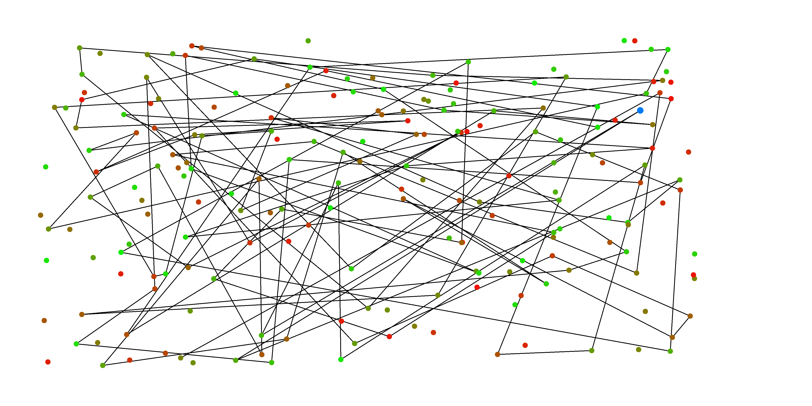
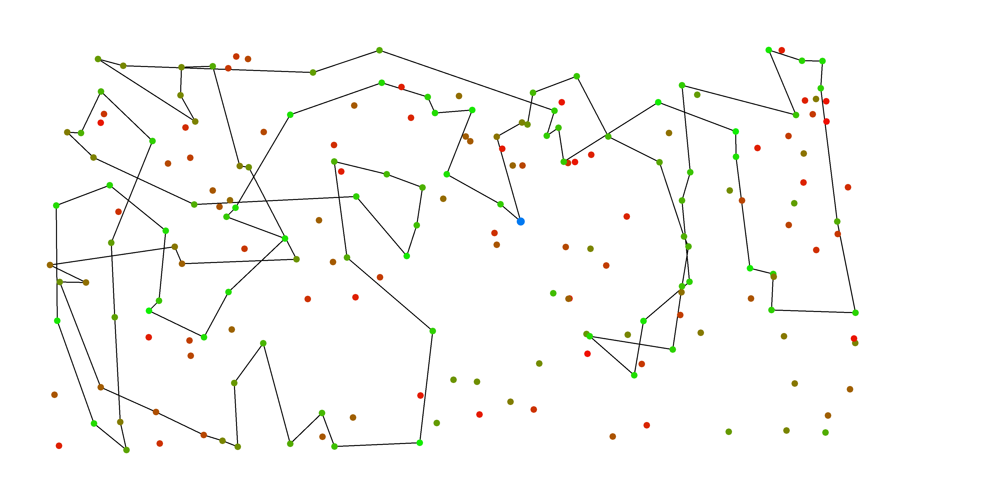
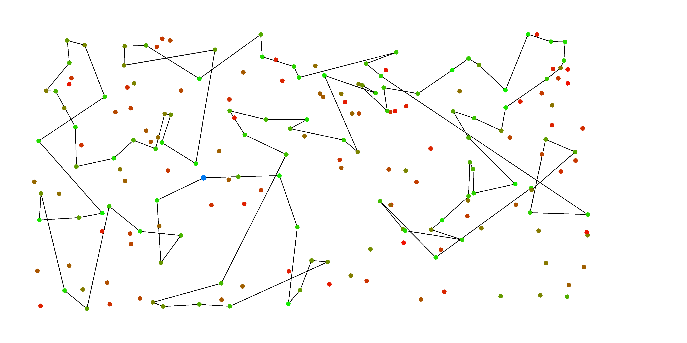
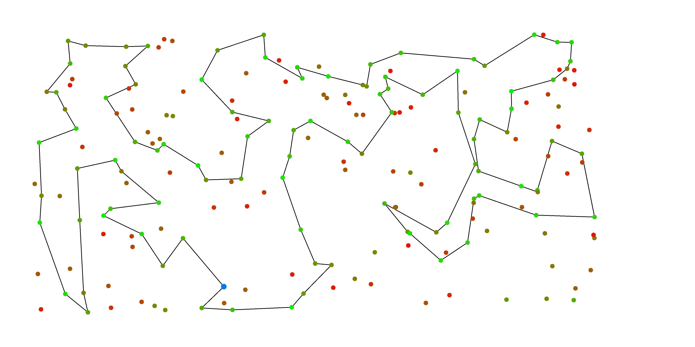

# Report Laboratories 1
Maciej Janicki 156073 
Jakub Kubiak 156049
[Source code](https://github.com/majanicki/ec/tree/trunk/lab01)

# Problem Description
Given a set of nodes, each having a set of coordinates ($x$, $y$) and inherent cost, pick exactly half of the nodes to form a Hamiltonian cycle. 

The goal is to minimze the sum of total path length plus the total cost of the selected nodes. 

# Pseudocode
## Random solution
Simplest approach, where the cycle is formed by randomly selecting appropriate number of nodes in arbitrary order. 

```
FUNCTION random_solution(dataset):
    target_size := CEIL(size of dataset / 2)
    result := empty list
    visited := empty set

    WHILE size of result < target_size:
        rand_node := RANDOM node from dataset that is not in visited
        ADD rand_node TO result
        ADD rand_node TO visited
    END WHILE

    RETURN result
END FUNCTION
```

## Nearest neighbor #1

```
FUNCTION nearest_neighbor_end_only(dataset, dist):
    target_size := half of dataset size (round up)
    result := empty list
    visited := empty set

    start := random node
    ADD start TO result
    ADD start TO visited

    WHILE size of result < target_size:
        last := last node in result
        nearest := unvisited node closest to last
        ADD nearest TO result
        ADD nearest TO visited
    END WHILE

    RETURN result
END FUNCTION
```

## Nearest neighbor #2
```
FUNCTION nearest_neighbor_every_position(dataset, dist):
    target_size := half of dataset size (round up)
    result := empty list

    start := random node
    ADD start TO result

    WHILE size of result < target_size:
        best_candidate := None
        best_distance := INFINITY
        insert_position := None
        FOR EACH current_node IN result:
            FOR EACH candidate IN dataset:
                IF dist[current_node, candidate] < best_distance:
                    best_distance := dist[current_node, candidate]
                    insert_position := after current_node position
                    best_candidate := candidate
                END IF
            END FOR
        END FOR
        REMOVE best_candidate FROM dataset
        INSERT best_candidate INTO result AT insert_position
    END WHILE
    RETURN result
END FUNCTION
```

## Greedy cycle
```
FUNCTION greedy_cycle(dataset, dist):
    target_size := half of dataset size (round up)
    result := empty list
    visited := empty set

    start := random node
    nearest := closest node to start
    ADD start and nearest TO result
    ADD start and nearest TO visited

    WHILE size of result < target_size:
        best_pos, best_node := NULL

        FOR EACH unvisited node:
            FOR EACH position in result:
                delta := cost of inserting node at position
                IF delta < best_delta:
                    best_delta := delta
                    best_node := node
                    best_pos := position
                END IF
            END FOR
        END FOR

        ADD best_node TO result at best_pos
        ADD best_node TO visited    
    END WHILE

    RETURN result
END FUNCTION
```


# Result Comparison

## TSPA

| Algorithm                       | Min Cost | Mean Cost | Max Cost |
|---------------------------------|-----------:|-----------:|-----------:|
| Random                          | 241,347    | 265,135    | 291,966    |
| Nearest Neighbor #1             | 83,182     | 85,108.5   | 89,433     |
| Nearest Neighbor #2             | 78,896     | 80,974.4   | 82,368     |
| Greedy Cycle                    | 71,488     | 72,646.4   | 74,410     |

## TSPB

| Algorithm                       | Min Cost | Mean Cost | Max Cost |
|---------------------------------|-----------:|-----------:|-----------:|
| Random                          | 190,834    | 213,771    | 241,363    |
| Nearest Neighbor #1             | 52,319     | 54,390.4   | 59,030     |
| Nearest Neighbor #2             | 52,992     | 55,015.8   | 57,460     |
| Greedy Cycle                    | 49,001     | 51,400.6   | 57,324     |

## Best solutions 

This section presents best solution found by each method. 
In visualizations greener nodes have lower cost than red nodes.
The solutions were checked with solution checker.

### Random

Random solution achieved lowest cost of `241,347`.

```
38
0
80
183
196
21
73
78
127
147
48
82
23
177
10
86
56
160
28
146
31
175
135
163
2
157
97
126
65
62
184
17
94
115
52
161
189
118
162
149
139
191
30
25
15
199
138
165
53
156
188
169
151
143
18
110
84
60
74
198
181
43
170
72
108
153
79
14
12
58
71
32
89
166
99
131
192
6
145
140
85
39
133
77
178
83
46
51
37
75
193
164
187
129
137
4
167
40
81
117
38
```



### Nearest neighbor #1

The lowest cost is `83,182`.

```
124
94
63
53
180
154
135
123
65
116
59
115
139
193
41
42
160
34
22
18
108
69
159
181
184
177
54
30
48
43
151
176
80
79
133
162
51
137
183
143
0
117
46
68
93
140
36
163
199
146
195
103
5
96
118
149
131
112
4
84
35
10
190
127
70
101
97
1
152
120
78
145
185
40
165
90
81
113
175
171
16
31
44
92
57
106
49
144
62
14
178
52
55
129
2
75
86
26
100
121
124
```



### Nearest neighbor #2

The lowest cost is `78,896`.

```
118
51
176
137
183
89
23
186
143
117
93
140
0
80
151
162
133
63
79
94
124
53
97
26
100
152
1
2
120
44
25
78
16
171
175
113
56
31
145
179
92
129
57
185
106
52
55
178
49
102
14
62
9
148
144
40
119
81
196
165
90
101
86
75
180
154
135
70
123
112
4
84
127
59
65
149
131
116
43
42
181
160
54
30
177
10
190
184
34
193
159
22
146
18
108
41
139
46
68
115
118
```



### Greedy cycle

The lowest cost is `71,488`.
```
0
117
143
183
89
186
23
137
176
80
79
63
94
124
152
97
1
101
2
120
129
55
49
102
148
9
62
144
14
178
106
165
90
81
196
40
119
185
52
57
92
179
145
78
31
56
113
175
171
16
25
44
75
86
26
100
53
154
180
135
70
127
123
162
133
151
51
118
59
65
116
43
184
35
84
112
4
190
10
177
30
54
48
160
34
146
22
18
108
69
159
181
42
5
115
41
193
139
68
46
0
```



# Conclusions

Random Algorithm achieves very poor results compared even to the most basic greedy algorithm.
Nearest Neighbor #1, Nearest Neighbor #2 and Greedy improve in results in this order.
Visual inspection suggests that Nearest Neighbor approaches generate long "jumps", especially when finally closing the cycle.
Greedy cycle does not behave this way.
