# Report Laboratories 2

Maciej Janicki 156073
Jakub Kubiak 156049
[Source code](https://github.com/majanicki/ec/tree/trunk/lab02)

# Problem Description

Given a set of nodes, each having a set of coordinates ($x$, $y$) and inherent cost, pick exactly half of the nodes to form a Hamiltonian cycle.

The goal is to minimze the sum of total path length plus the total cost of the selected nodes.

# Pseudocode

## Nearest Neighbor (extended) Regret

```
FUNCTION nearest_neighbor_regret(dataset, dist, start):
    target_size := ceil(dataset.size / 2)
    result := [dataset[start]]
    used := {start}

    WHILE result.size < target_size:
        max_regret, best_node, best_pos := -INFINITY, null, 0

        FOR each node IN dataset IF not used:
            min_cost, second_min_cost, insert_pos := INF, INF, 0

            FOR i from -1 to result.size - 1:
                cost :=
                    if i = -1: dist(node, result[0])
                    else if i = result.size - 1: dist(result[i], node)
                    else: dist(result[i], node) + dist(node, result[i+1]) - dist(result[i], result[i+1])

                if cost < min_cost:
                    second_min_cost := min_cost
                    min_cost := cost
                    insert_pos := i
                else if cost < second_min_cost:
                    second_min_cost := cost

            regret := second_min_cost - min_cost
            if regret > max_regret:
                max_regret := regret
                best_node := node
                best_pos := insert_pos

        INSERT best_node into result at best_pos + 1
        ADD best_node to used

    RETURN result
```

## Nearest Neighbor (extended) Regret weighted

```
FUNCTION nearest_neighbor_regret(dataset, dist, start, weight_cost, weight_regret):
    target_size := ceil(dataset.size / 2)
    result := [dataset[start]]
    used := {start}

    WHILE result.size < target_size:
        max_weighted_sum, best_node, best_pos := -INFINITY, null, 0

        FOR each node IN dataset IF not used:
            min_cost, second_min_cost, insert_pos := INF, INF, 0

            FOR i from -1 to result.size - 1:
                cost :=
                    if i = -1: dist(node, result[0])
                    else if i = result.size - 1: dist(result[i], node)
                    else: dist(result[i], node) + dist(node, result[i+1]) - dist(result[i], result[i+1])

                if cost < min_cost:
                    second_min_cost := min_cost
                    min_cost := cost
                    insert_pos := i
                else if cost < second_min_cost:
                    second_min_cost := cost

            regret := second_min_cost - min_cost
            weighted_sum := -min_cost * weight_cost + regret * weight_regret
            if weighted_sum > max_weighted_sum:
                max_weighted_sum := weighted_sum
                best_node := node
                best_pos := insert_pos

        INSERT best_node into result at best_pos + 1
        ADD best_node to used

    RETURN result
```

## Greedy Cycle Regret

```
FUNCTION greedy_cycle_regret(dataset, dist, start):
    target_size := ceil(dataset.size / 2)
    result := [dataset[start]]
    used := {start}

    WHILE size of result < target_size:
        max_regret, best_node, best_pos := -INFINITY, null, 0

        FOR each node IN dataset IF not used:
            min_cost, second_min_cost, insert_pos := INFINITY, INFINITY, 0

            FOR EACH position in result:
                current_node := result[position]
                next_node := result[(position + 1) MOD result.size]

                cost_current_edge := dist(current_node, next_node)
                cost_new_edge := dist(current_node, dataset[node]) + dist(dataset[node], next_node)
                cost := cost_new_edge - cost_current_edge

                IF cost < min_cost THEN:
                    second_min_cost := min_cost
                    min_cost := cost
                    insert_pos := position
                ELSE IF cost < second_min_cost THEN:
                    second_min_cost := cost
            regret := second_min_cost - min_cost

            IF regret >= max_regret THEN
                max_regret := regret
                best_node := dataset[node]
                best_pos := insert_pos

        INSERT best_node into result at position best_pos + 1
        ADD best_pos TO used
    END WHILE

    RETURN result
END FUNCTION
```

## Greedy Cycle Regret Weighted

```
FUNCTION greedy_cycle_regret_weighted(dataset, dist, start, weight_cost, weight_regret):
    target_size := ceil(dataset.size / 2)
    result := [dataset[start]]
    used := {start}

    WHILE size of result < target_size:
        best_weighted_sum, best_node, best_pos := -INFINITY, null, 0

        FOR each node IN dataset IF not used:
            min_cost, second_min_cost, insert_pos := INFINITY, INFINITY, 0

            FOR EACH position in result:
                current_node := result[position]
                next_node := result[(position + 1) MOD result.size]

                cost_current_edge := dist(current_node, next_node)
                cost_new_edge := dist(current_node, dataset[node]) + dist(dataset[node], next_node)
                cost := cost_new_edge - cost_current_edge

                IF cost < min_cost THEN:
                    second_min_cost := min_cost
                    min_cost := cost
                    insert_pos := position
                ELSE IF cost < second_min_cost THEN:
                    second_min_cost := cost

            regret := second_min_cost - min_cost
            weighted_sum += -(min_cost * weight_cost) + (regret * weight_regret)

            IF weighted_sum >= best_weighted_sum THEN
                best_weighted_sum := weighted_sum
                best_node := dataset[node]
                best_pos := insert_pos

        INSERT best_node into result at position best_pos + 1
        ADD best_pos TO used
    END WHILE

    RETURN result
END FUNCTION
```

# Result Comparison

## TSPA regret

| Algorithm                                   | Min Cost | Mean Cost | Max Cost |
| ------------------------------------------- | -------: | --------: | -------: |
| Nearest Neighbor Regret                     |  107,945 |   117,516 |  128,071 |
| Greedy Cycle Regret                         |  106,052 |   115,137 |  123,750 |
| Nearest Neighbor Regret Weighted (0.5, 0.5) |   70,894 |  73,566.7 |   75,929 |
| Greedy Cycle Regret Weighted (0.5, 0.5)     |   71,108 |  72,137.6 |   73,395 |
| Nearest Neighbor Regret Weighted (0.3, 0.7) |   72,155 |  75,562.1 |   78,661 |
| Greedy Cycle Regret Weighted (0.3, 0.7)     |   70,475 |  73,010.6 |   75,365 |
| Nearest Neighbor Regret Weighted (0.7, 0.3) |   71,519 |  73,412.8 |   75,234 |
| Greedy Cycle Regret Weighted (0.7, 0.3)     |   71,163 |  72,437.2 |   73,759 |

## TSPB regret

| Algorithm                                   | Min Cost | Mean Cost | Max Cost |
| ------------------------------------------- | -------: | --------: | -------: |
| Nearest Neighbor Regret                     |   67,345 |  73,512.7 |   78,889 |
| Greedy Cycle Regret                         |   67,729 |  73,316.1 |   77,498 |
| Nearest Neighbor Regret Weighted (0.5, 0.5) |   44,901 |    49,847 |   57,036 |
| Greedy Cycle Regret Weighted (0.5, 0.5)     |   47,144 |  50,827.2 |   55,700 |
| Nearest Neighbor Regret Weighted (0.3, 0.7) |   47,543 |  51,784.2 |   59,409 |
| Greedy Cycle Regret Weighted (0.3, 0.7)     |   49,944 |  52,420.1 |   56,179 |
| Nearest Neighbor Regret Weighted (0.7, 0.3) |   45,153 |  48,816.6 |   53,425 |
| Greedy Cycle Regret Weighted (0.7, 0.3)     |   49,326 |  51,173.3 |   53,437 |

## TSPA (previous labs)

| Algorithm           | Min Cost | Mean Cost | Max Cost |
| ------------------- | -------: | --------: | -------: |
| Random              |  241,347 |   265,135 |  291,966 |
| Nearest Neighbor #1 |   83,182 |  85,108.5 |   89,433 |
| Nearest Neighbor #2 |   78,896 |  80,974.4 |   82,368 |
| Greedy Cycle        |   71,488 |  72,646.4 |   74,410 |

## TSPB (previous labs)

| Algorithm           | Min Cost | Mean Cost | Max Cost |
| ------------------- | -------: | --------: | -------: |
| Random              |  190,834 |   213,771 |  241,363 |
| Nearest Neighbor #1 |   52,319 |  54,390.4 |   59,030 |
| Nearest Neighbor #2 |   52,992 |  55,015.8 |   57,460 |
| Greedy Cycle        |   49,001 |  51,400.6 |   57,324 |

# Visualizations

## TSPA

### Nearest Neighbor Regret

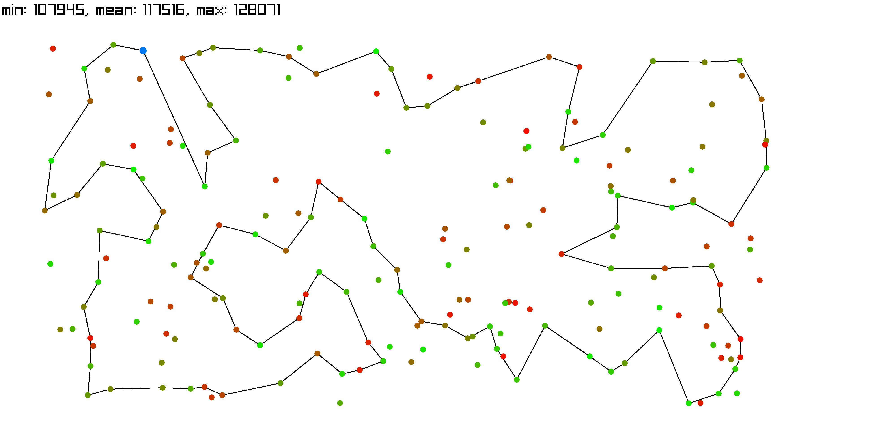

### Greedy Cycle Regret

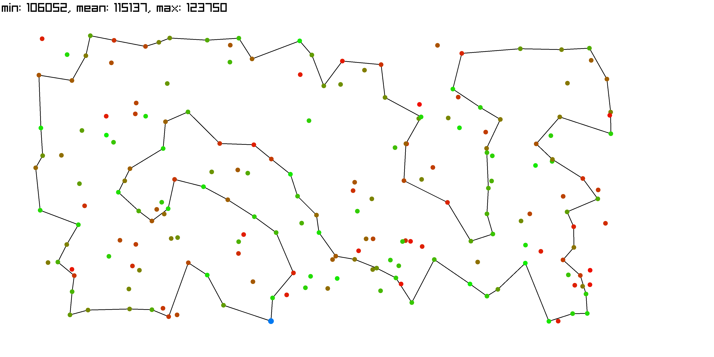

### Nearest Neighbor Regret Weighted

#### Cost: 0.5, Regret: 0.5

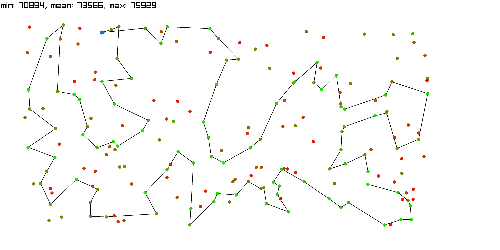

#### Cost: 0.3, Regret: 0.7

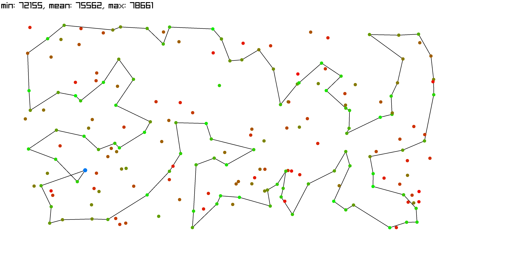

#### Cost: 0.7, Regret: 0.3

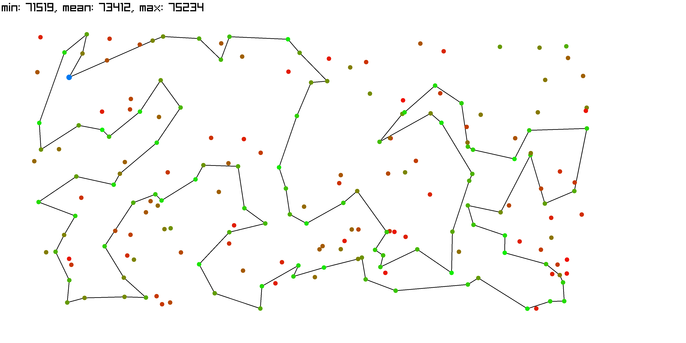

### Greedy Cycle Regret Weighted

#### Cost: 0.5, Regret: 0.5

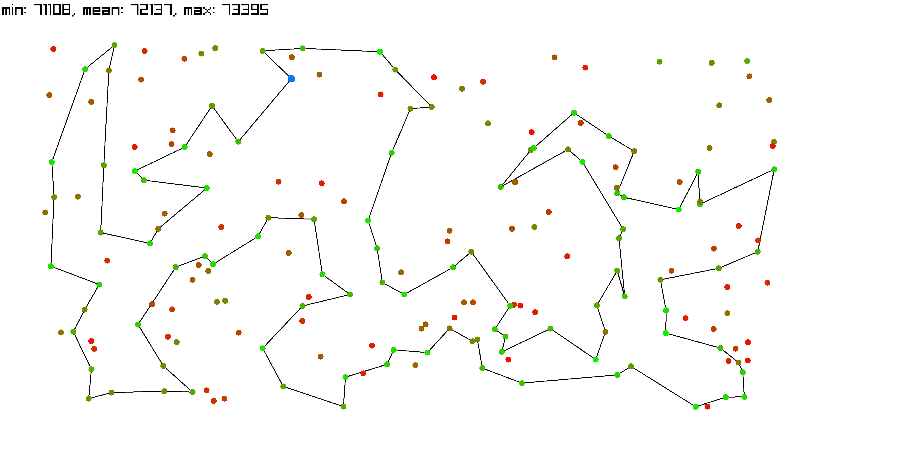

#### Cost: 0.3, Regret: 0.7

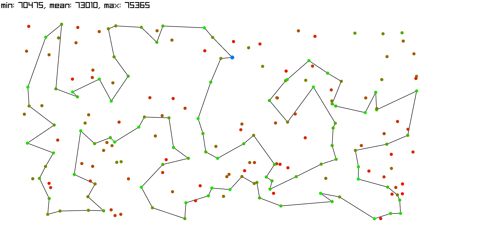

#### Cost: 0.7, Regret: 0.3

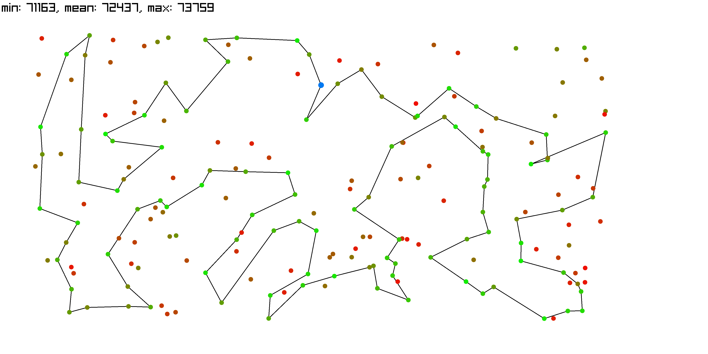

## TSPB

### Nearest Neighbor Regret

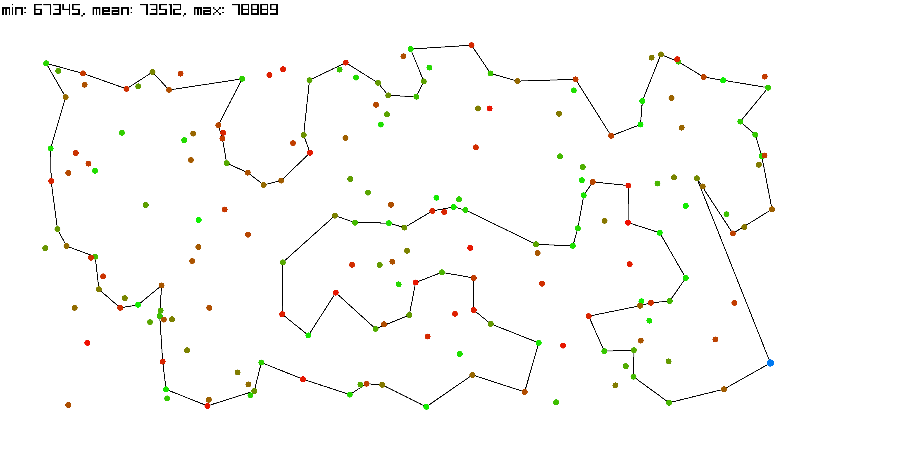

### Greedy Cycle Regret

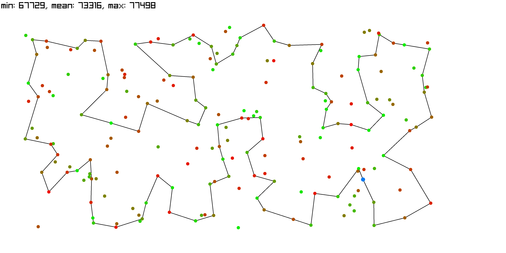

### Nearest Neighbor Regret Weighted

#### Cost: 0.5, Regret: 0.5

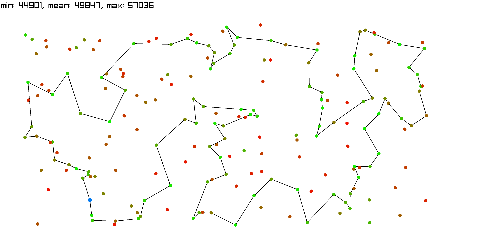

#### Cost: 0.3, Regret: 0.7

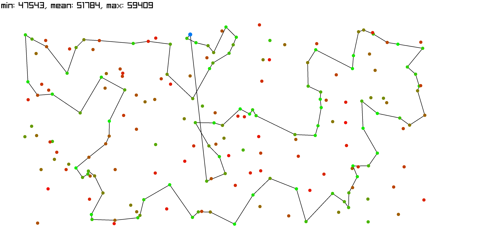

#### Cost: 0.7, Regret: 0.3

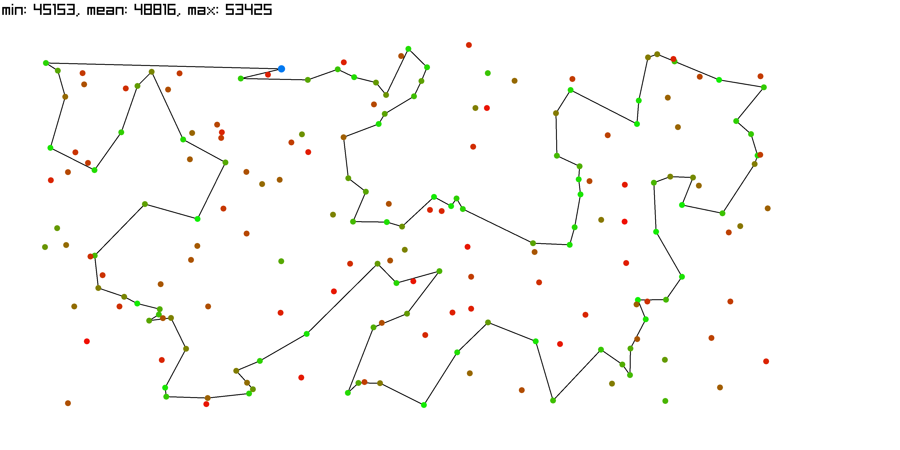

### Greedy Cycle Regret Weighted

#### Cost: 0.5, Regret: 0.5

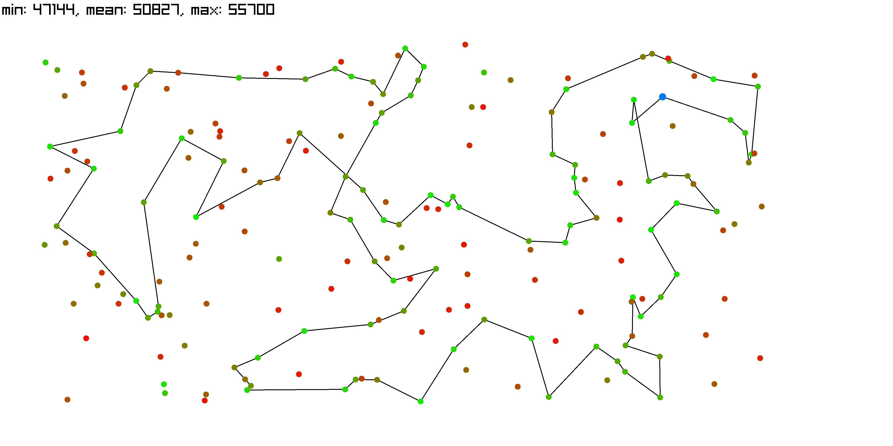

#### Cost: 0.3, Regret: 0.7

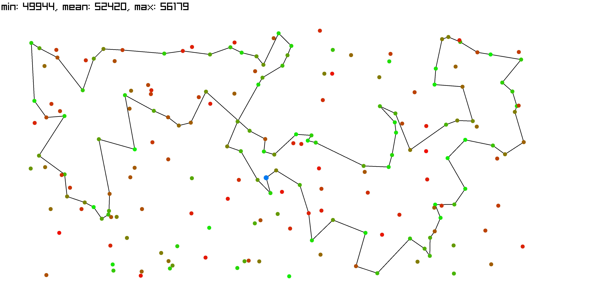

#### Cost: 0.7, Regret: 0.3

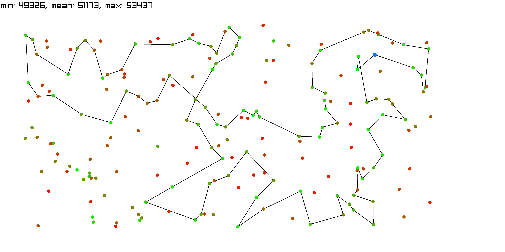

# Conclusions

- Including a regret measure (especially properly weighted) helps in avoiding short-sighted decision. Nodes that would later create expensive insertions are avoided.

- Greedy Cycle Regret slightly outperforms Extended Nearest Neighbor Regret on average across both datasets.

- Weighted methods perform better than their unweighted counterparts.
