---
geometry: margin=30mm
...

# Report Laboratories 2

Maciej Janicki 156073
Jakub Kubiak 156049

[Source code](https://github.com/majanicki/ec/tree/trunk/lab02)

# Problem Description

Given a set of nodes, each having a set of coordinates ($x$, $y$) and inherent cost, pick exactly half of the nodes to form a Hamiltonian cycle.

The goal is to minimze the sum of total path length plus the total cost of the selected nodes.

# Pseudocode

## Common Functionality

```
FUNCTION get_move_delta(move, solution, dataset, dist):
    SWITCH move.kind:
        CASE INTER_ROUTE:
            candidate := dataset[move.dataset_index]
            prev_node := solution[move.solution_index - 1 if move.solution_index > 0 else solution.size - 1]
            swap_out_node := solution[move.solution_index]
            next_node := solution[(move.solution_index + 1) % solution.size]
            old_cost := dist(prev_node, swap_out_node) + dist(swap_out_node, next_node) + swap_out_node.cost
            new_cost := dist(prev_node, candidate) + dist(candidate, next_node) + candidate.cost
            RETURN new_cost - old_cost

        CASE INTRA_ROUTE_NODE_EXCHANGE:
            node_a := solution[move.swap_index_a]
            node_b := solution[move.swap_index_b]
            prev_a := solution[move.swap_index_a - 1 if move.swap_index_a > 0 else solution.size - 1]
            next_a := solution[(move.swap_index_a + 1) % solution.size]
            prev_b := solution[move.swap_index_b - 1 if move.swap_index_b > 0 else solution.size - 1]
            next_b := solution[(move.swap_index_b + 1) % solution.size]
            IF next_a.id == node_b.id OR next_b.id == node_a.id:
                old_cost := dist(prev_a, node_a) + dist(node_a, node_b) + dist(node_b, next_b)
                new_cost := dist(prev_a, node_b) + dist(node_b, node_a) + dist(node_a, next_b)
            ELSE:
                old_cost := dist(prev_a, node_a) + dist(node_a, next_a) + dist(prev_b, node_b) + dist(node_b, next_b)
                new_cost := dist(prev_a, node_b) + dist(node_b, next_a) + dist(prev_b, node_a) + dist(node_a, next_b)
            RETURN new_cost - old_cost

        CASE INTRA_ROUTE_EDGE_EXCHANGE:
            a := move.swap_index_a
            b := move.swap_index_b
            c := (a + 1) % solution.size
            d := (b + 1) % solution.size
            node_a := solution[a]
            node_b := solution[b]
            node_c := solution[c]
            node_d := solution[d]
            old_cost := dist(node_a, node_c) + dist(node_b, node_d)
            new_cost := dist(node_a, node_b) + dist(node_c, node_d)
            RETURN new_cost - old_cost

FUNCTION act_on_move(move, solution, dataset, used):
    IF NOT move.valid: RETURN false
    SWITCH move.kind:
        CASE INTER_ROUTE:
            used[solution[move.solution_index].id] := false
            used[move.dataset_index] := true
            solution[move.solution_index] := dataset[move.dataset_index]
        CASE INTRA_ROUTE_NODE_EXCHANGE:
            SWAP(solution[move.swap_index_a], solution[move.swap_index_b])
        CASE INTRA_ROUTE_EDGE_EXCHANGE:
            a := move.swap_index_a
            b := move.swap_index_b
            IF a < b:
                REVERSE(solution[a+1 to b])
            ELSE:
                segment := solution[a+1 to end] + solution[0 to b]
                REVERSE(segment)
                FOR i IN 0 to segment.size - 1:
                    solution[(a+1+i) % solution.size] := segment[i]
    RETURN true
```

\newpage

## Greedy Local Search

```
FUNCTION get_random_improving_move(solution, dataset, dist, used, intra_kind):
    inter_solution_index := 0
    inter_dataset_index := 0
    intra_a := 0
    intra_b := 1
    range_start := 0
    range_end := 1

    WHILE range_end - range_start >= 0:
        move_kind := RANDOM_INT(range_start, range_end)
        IF move_kind == 0:
            IF inter_dataset_index >= dataset.size:
                inter_solution_index += 1
                IF inter_solution_index >= solution.size:
                    range_start := 1
                    CONTINUE
                inter_dataset_index := 0
            IF used[inter_dataset_index]:
                inter_dataset_index += 1
                CONTINUE
            move := INTER_ROUTE_MOVE(inter_solution_index, inter_dataset_index)
            delta := get_move_delta(move, solution, dataset, dist)
            IF delta < 0: RETURN move
            inter_dataset_index += 1
        ELSE IF move_kind == 1:
            IF intra_b >= solution.size:
                intra_a += 1
                intra_b := intra_a + 1
                IF intra_a >= solution.size OR intra_b >= solution.size:
                    range_end := 0
                    CONTINUE
            IF intra_kind == NODE_EXCHANGE: move := INTRA_NODE_EXCHANGE_MOVE(intra_a, intra_b)
            ELSE IF intra_kind == EDGE_EXCHANGE: move := INTRA_EDGE_EXCHANGE_MOVE(intra_a, intra_b)
            delta := get_move_delta(move, solution, dataset, dist)
            IF delta < 0: RETURN move
            intra_b += 1
    RETURN invalid move

FUNCTION local_search_random(solution, dataset, dist, intra_kind):
    used := array(dataset.size) initialized false
    FOR i IN 0 to solution.size-1:
        used[solution[i].id] := true

    WHILE true:
        move := get_random_improving_move(solution, dataset, dist, used, intra_kind)
        IF NOT act_on_move(move, solution, dataset, used):
            BREAK
    RETURN solution
```

\newpage

## Steepest Local Search

```
FUNCTION get_best_move(solution, dataset, dist, used, intra_kind):
    best_move.valid := false
    best_delta := 0

    FOR i IN 0 to solution.size-1:
        FOR j IN 0 to dataset.size-1:
            IF used[j]: CONTINUE
            move := INTER_ROUTE_MOVE(i, j)
            delta := get_move_delta(move, solution, dataset, dist)
            IF delta < best_delta:
                best_delta := delta
                best_move := move

    FOR each pair (a,b) IN solution WHERE a < b:
        IF intra_kind == NODE_EXCHANGE: move := INTRA_NODE_EXCHANGE_MOVE(a,b)
        ELSE IF intra_kind == EDGE_EXCHANGE: move := INTRA_EDGE_EXCHANGE_MOVE(a,b)
        delta := get_move_delta(move, solution, dataset, dist)
        IF delta < best_delta:
            best_delta := delta
            best_move := move

    RETURN best_move IF best_delta < 0 ELSE invalid move

FUNCTION local_search_steepest(solution, dataset, dist, intra_kind):
    used := array(dataset.size) initialized false
    FOR i IN 0 to solution.size-1:
        used[solution[i].id] := true

    WHILE true:
        move := get_best_move(solution, dataset, dist, used, intra_kind)
        IF NOT act_on_move(move, solution, dataset, used):
            BREAK
    RETURN solution
```

\newpage

# Result Comparison

## TSPA

| Algorithm                                   | Cost (Mean (Min, Max))     |
| ------------------------------------------- | -------------------------- |
| Random                                      | 265,135 (241,347, 291,966) |
| Nearest Neighbor #1                         | 85,108.5 (83,182, 89,433)  |
| Nearest Neighbor #2                         | 73,601.7 (71,868, 75,953)  |
| Greedy Cycle                                | 72,646.4 (71,488, 74,410)  |
| Nearest Neighbor Regret                     | 117,516 (107,945, 128,071) |
| Greedy Cycle Regret                         | 115,137 (106,052, 123,750) |
| Nearest Neighbor Regret Weighted (0.5, 0.5) | 73,566.7 (70,894, 75,929)  |
| Greedy Cycle Regret Weighted (0.5, 0.5)     | 72,137.6 (71,108, 73,395)  |
| Nearest Neighbor Regret Weighted (0.3, 0.7) | 75,562.1 (72,155, 78,661)  |
| Greedy Cycle Regret Weighted (0.3, 0.7)     | 73,010.6 (70,475, 75,365)  |
| Nearest Neighbor Regret Weighted (0.7, 0.3) | 73,412.8 (71,519, 75,234)  |
| Greedy Cycle Regret Weighted (0.7, 0.3)     | 72,437.2 (71,163, 73,759)  |
| Local Search Greedy + Intra Nodes + Random Start         | 83,804.35 (77,418.00, 90,972.00) |
| Local Search Greedy + Intra Nodes + Greedy Start         | 72,806.49 (71,034.00, 74,987.00) |
| Local Search Greedy + Intra Edges + Random Start         | 73,387.63 (71,248.00, 78,480.00) |
| Local Search Greedy + Intra Edges + Greedy Start         | 71,067.07 (70,046.00, 73,486.00) |
| Local Search Steepest + Intra Nodes + Random Start       | 87,883.71 (79,593.00, 98,325.00) |
| Local Search Steepest + Intra Nodes + Greedy Start       | 72,807.32 (71,034.00, 74,904.00) |
| Local Search Steepest + Intra Edges + Random Start       | 73,938.93 (71,428.00, 77,903.00) |
| Local Search Steepest + Intra Edges + Greedy Start       | 70,975.96 (69,864.00, 73,068.00) |

## TSPB

| Algorithm                                   | Cost (Mean (Min, Max))     |
| ------------------------------------------- | -------------------------- |
| Random                                      | 213,771 (190,834, 241,363) |
| Nearest Neighbor #1                         | 54,390.4 (52,319, 59,030)  |
| Nearest Neighbor #2                         | 48,723.2 (44,609, 57,315)  |
| Greedy Cycle                                | 51,400.6 (49,001, 57,324)  |
| Nearest Neighbor Regret                     | 73,512.7 (67,345, 78,889)  |
| Greedy Cycle Regret                         | 73,316.1 (67,729, 77,498)  |
| Nearest Neighbor Regret Weighted (0.5, 0.5) | 49,847 (44,901, 57,036)    |
| Greedy Cycle Regret Weighted (0.5, 0.5)     | 50,827.2 (47,144, 55,700)  |
| Nearest Neighbor Regret Weighted (0.3, 0.7) | 51,784.2 (47,543, 59,409)  |
| Greedy Cycle Regret Weighted (0.3, 0.7)     | 52,420.1 (49,944, 56,179)  |
| Nearest Neighbor Regret Weighted (0.7, 0.3) | 48,816.6 (45,153, 53,425)  |
| Greedy Cycle Regret Weighted (0.7, 0.3)     | 51,173.3 (49,326, 53,437)  |
| Local Search Greedy + Intra Nodes + Random Start         | 59,076.75 (52,869.00, 67,067.00) |
| Local Search Greedy + Intra Nodes + Greedy Start         | 45,468.38 (43,989.00, 51,040.00) |
| Local Search Greedy + Intra Edges + Random Start         | 48,161.21 (45,907.00, 51,461.00) |
| Local Search Greedy + Intra Edges + Greedy Start         | 45,053.77 (43,947.00, 50,319.00) |
| Local Search Steepest + Intra Nodes + Random Start       | 62,947.23 (54,122.00, 71,598.00) |
| Local Search Steepest + Intra Nodes + Greedy Start       | 45,414.50 (43,826.00, 50,876.00) |
| Local Search Steepest + Intra Edges + Random Start       | 48,323.99 (45,670.00, 51,667.00) |
| Local Search Steepest + Intra Edges + Greedy Start       | 44,974.89 (43,921.00, 50,319.00) |


\newpage

# Execution Time Comparison

## TSPA

| Algorithm                             | Time (Mean (Min, Max)) [ms] |
|---------------------------------------|------------------------------|
| Local Search Greedy + Intra Nodes + Random Start   | 36.36 (16.00, 69.92)        |
| Local Search Greedy + Intra Nodes + Greedy Start   | 2.49 (1.80, 5.13)           |
| Local Search Greedy + Intra Edges + Random Start   | 48.81 (23.56, 70.97)        |
| Local Search Greedy + Intra Edges + Greedy Start   | 3.28 (1.95, 5.24)           |
| Local Search Steepest + Intra Nodes + Random Start | 21.89 (16.96, 31.65)        |
| Local Search Steepest + Intra Nodes + Greedy Start | 2.10 (1.55, 3.00)           |
| Local Search Steepest + Intra Edges + Random Start | 15.45 (13.59, 19.09)        |
| Local Search Steepest + Intra Edges + Greedy Start | 2.78 (1.83, 3.85)           |

## TSPB

| Algorithm                             | Time (Mean (Min, Max)) [ms] |
|---------------------------------------|------------------------------|
| Local Search Greedy + Intra Nodes + Random Start   | 35.84 (19.78, 59.54)        |
| Local Search Greedy + Intra Nodes + Greedy Start   | 2.67 (1.85, 7.62)           |
| Local Search Greedy + Intra Edges + Random Start   | 42.71 (22.79, 62.96)        |
| Local Search Greedy + Intra Edges + Greedy Start   | 2.92 (1.77, 7.81)           |
| Local Search Steepest + Intra Nodes + Random Start | 22.20 (17.60, 29.57)        |
| Local Search Steepest + Intra Nodes + Greedy Start | 2.31 (1.81, 4.95)           |
| Local Search Steepest + Intra Edges + Random Start | 15.45 (13.17, 17.90)        |
| Local Search Steepest + Intra Edges + Greedy Start | 2.36 (1.86, 4.88)           |

\newpage

# Visualizations

## TSPA

### Local Search Greedy

#### Intra Nodes + Random Start

165, 39, 164, 7, 21, 144, 23, 46, 139, 193, 41, 5, 116, 65, 43, 42, 160, 184, 190, 10, 177, 54, 48, 34, 181, 146, 22, 18, 69, 108, 140, 93, 68, 115, 59, 162, 151, 79, 80, 176, 137, 0, 117, 143, 183, 89, 186, 15, 148, 94, 63, 180, 154, 133, 123, 127, 70, 135, 53, 100, 26, 97, 1, 101, 2, 78, 31, 113, 175, 171, 16, 75, 86, 152, 167, 9, 62, 102, 49, 14, 3, 178, 92, 129, 120, 44, 25, 145, 179, 57, 55, 52, 106, 185, 196, 81, 90, 119, 40, 8, 165

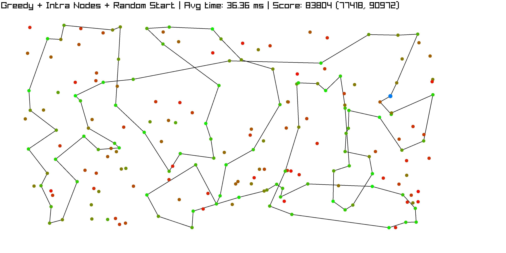

\newpage

#### Intra Nodes + Greedy Start

68, 46, 115, 139, 193, 41, 5, 42, 181, 159, 69, 108, 18, 22, 146, 34, 160, 48, 54, 177, 10, 190, 4, 112, 84, 35, 184, 43, 116, 65, 59, 118, 51, 151, 133, 162, 123, 127, 70, 135, 154, 180, 53, 100, 26, 86, 75, 44, 25, 16, 171, 175, 113, 56, 31, 78, 145, 179, 57, 55, 52, 185, 119, 40, 196, 81, 90, 165, 106, 178, 14, 144, 62, 9, 148, 102, 49, 92, 129, 120, 2, 101, 1, 97, 152, 124, 94, 63, 79, 80, 176, 137, 23, 186, 89, 183, 143, 0, 117, 93, 68


\newpage

#### Intra Edges + Random Init

78, 145, 196, 81, 31, 56, 113, 175, 171, 16, 25, 44, 120, 129, 2, 152, 97, 1, 101, 75, 86, 26, 53, 180, 154, 135, 70, 127, 123, 112, 4, 10, 177, 54, 48, 184, 160, 34, 181, 42, 5, 43, 116, 65, 149, 59, 118, 51, 151, 162, 133, 79, 63, 94, 80, 176, 137, 46, 68, 139, 115, 41, 193, 159, 22, 18, 69, 108, 93, 117, 0, 170, 143, 183, 89, 23, 186, 15, 148, 9, 62, 102, 49, 14, 144, 21, 7, 164, 90, 165, 119, 40, 185, 106, 3, 178, 52, 55, 57, 92, 78

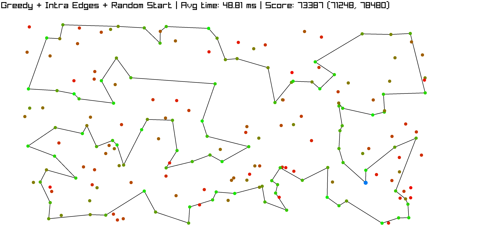

\newpage

#### Intra Edges + Greedy Start

196, 81, 90, 165, 14, 49, 102, 144, 62, 9, 148, 186, 23, 89, 183, 143, 0, 117, 93, 140, 68, 46, 115, 139, 69, 108, 18, 22, 146, 159, 193, 41, 5, 42, 181, 34, 160, 48, 54, 177, 10, 190, 4, 112, 84, 35, 184, 43, 116, 65, 59, 118, 51, 137, 176, 80, 94, 63, 79, 133, 151, 162, 123, 127, 70, 135, 154, 180, 53, 86, 100, 26, 97, 152, 1, 101, 75, 2, 120, 44, 25, 16, 171, 175, 113, 56, 31, 78, 145, 179, 92, 129, 57, 55, 52, 178, 106, 185, 119, 40, 196

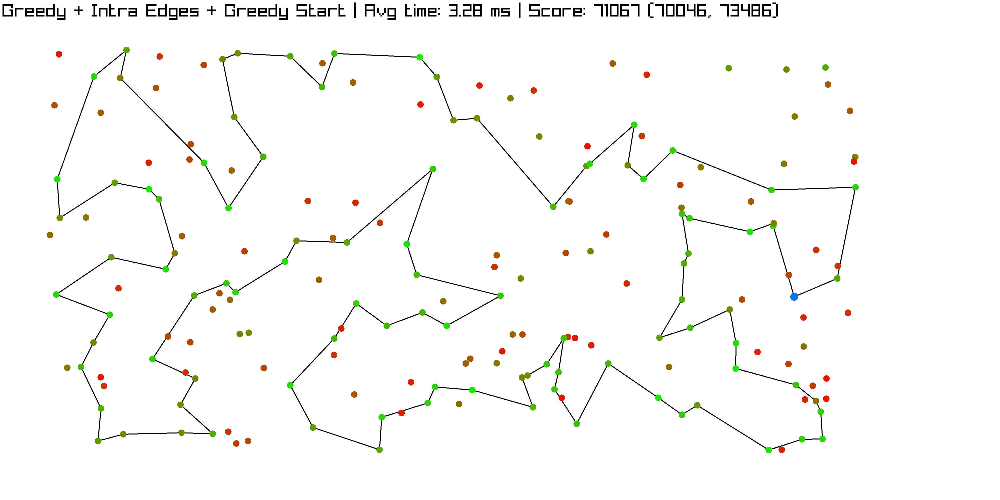

\newpage

### Local Search Steepest

#### Intra Nodes + Random Start

26, 97, 1, 152, 124, 167, 148, 15, 186, 89, 23, 137, 118, 65, 116, 43, 160, 34, 54, 177, 4, 112, 184, 42, 5, 41, 193, 51, 176, 80, 79, 133, 151, 46, 68, 93, 140, 108, 18, 159, 22, 146, 181, 149, 123, 127, 70, 162, 59, 115, 198, 139, 117, 0, 143, 183, 9, 62, 102, 144, 164, 27, 90, 165, 119, 40, 81, 196, 129, 2, 53, 154, 135, 180, 63, 94, 49, 14, 178, 106, 57, 92, 82, 25, 16, 171, 175, 113, 31, 185, 52, 55, 179, 145, 78, 44, 120, 75, 101, 86, 26

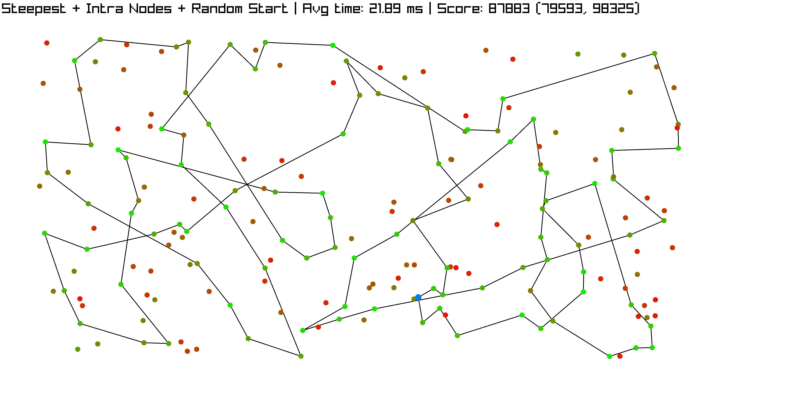

\newpage

#### Intra Nodes + Greedy Start

68, 46, 115, 139, 193, 41, 5, 42, 181, 159, 69, 108, 18, 22, 146, 34, 160, 48, 54, 177, 10, 190, 4, 112, 84, 35, 184, 43, 116, 65, 59, 118, 51, 151, 133, 162, 123, 127, 70, 135, 154, 180, 53, 100, 26, 86, 75, 44, 25, 16, 171, 175, 113, 56, 31, 78, 145, 179, 57, 55, 52, 185, 119, 40, 196, 81, 90, 165, 106, 178, 14, 144, 62, 9, 148, 102, 49, 92, 129, 120, 2, 101, 1, 97, 152, 124, 94, 63, 79, 80, 176, 137, 23, 186, 89, 183, 143, 0, 117, 93, 68

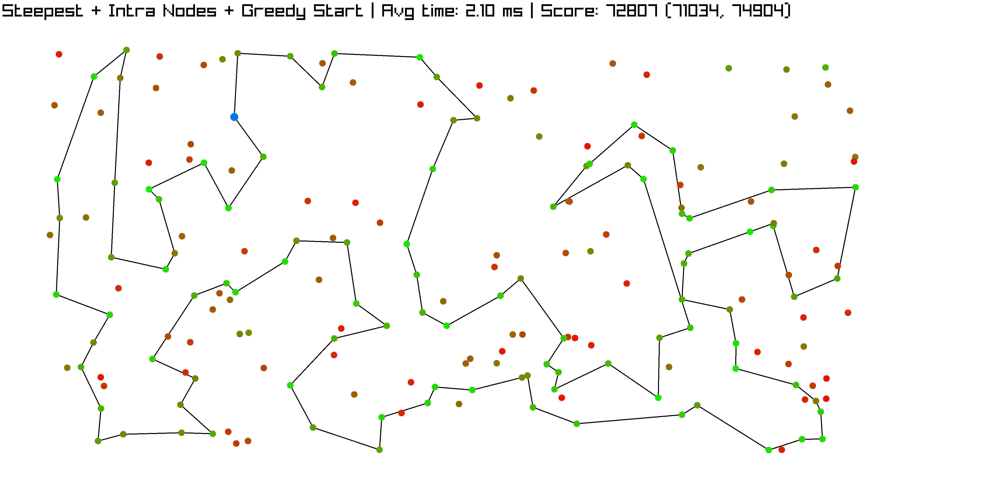

\newpage

#### Intra Edges + Random Init

171, 16, 25, 44, 120, 75, 101, 86, 100, 26, 97, 1, 2, 152, 124, 94, 122, 80, 176, 51, 46, 115, 139, 193, 41, 42, 43, 116, 65, 59, 162, 151, 133, 79, 63, 53, 158, 180, 154, 135, 70, 127, 123, 112, 4, 84, 184, 190, 10, 177, 54, 48, 160, 34, 181, 159, 146, 22, 18, 108, 93, 117, 0, 143, 183, 89, 23, 137, 186, 15, 148, 37, 9, 62, 102, 49, 144, 14, 178, 106, 52, 55, 57, 129, 92, 78, 145, 179, 196, 185, 40, 165, 27, 90, 81, 157, 31, 56, 113, 175, 171

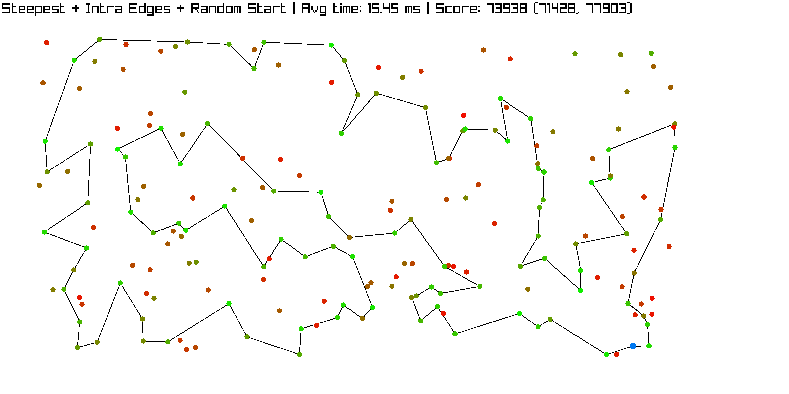
\newpage

#### Intra Edges + Greedy Start

196, 81, 90, 165, 119, 40, 185, 106, 178, 14, 144, 49, 102, 62, 9, 148, 94, 63, 79, 133, 80, 176, 137, 23, 186, 89, 183, 143, 0, 117, 93, 140, 108, 69, 18, 22, 146, 159, 193, 41, 5, 42, 181, 34, 160, 48, 54, 177, 10, 190, 4, 112, 84, 35, 184, 43, 116, 65, 59, 118, 115, 139, 68, 46, 51, 151, 162, 123, 127, 70, 135, 154, 180, 53, 86, 100, 26, 97, 152, 1, 101, 75, 2, 120, 44, 25, 16, 171, 175, 113, 56, 31, 78, 145, 179, 92, 129, 57, 55, 52, 196

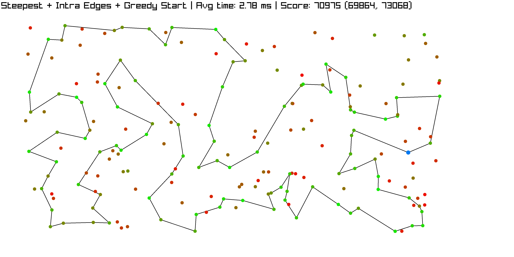

\newpage

## TSPB

### Local Search Greedy

#### Intra Nodes + Random Start

82, 21, 177, 5, 78, 175, 80, 190, 193, 198, 117, 54, 31, 73, 121, 118, 134, 6, 188, 169, 70, 3, 15, 145, 132, 13, 195, 182, 25, 36, 61, 141, 97, 77, 81, 153, 163, 89, 103, 113, 176, 106, 124, 62, 18, 55, 183, 9, 148, 47, 60, 20, 59, 28, 149, 4, 184, 155, 29, 160, 144, 8, 104, 33, 138, 11, 139, 74, 51, 191, 90, 10, 133, 122, 135, 32, 102, 63, 40, 107, 147, 43, 168, 109, 0, 35, 143, 95, 185, 86, 194, 166, 179, 66, 94, 140, 152, 170, 34, 111, 82

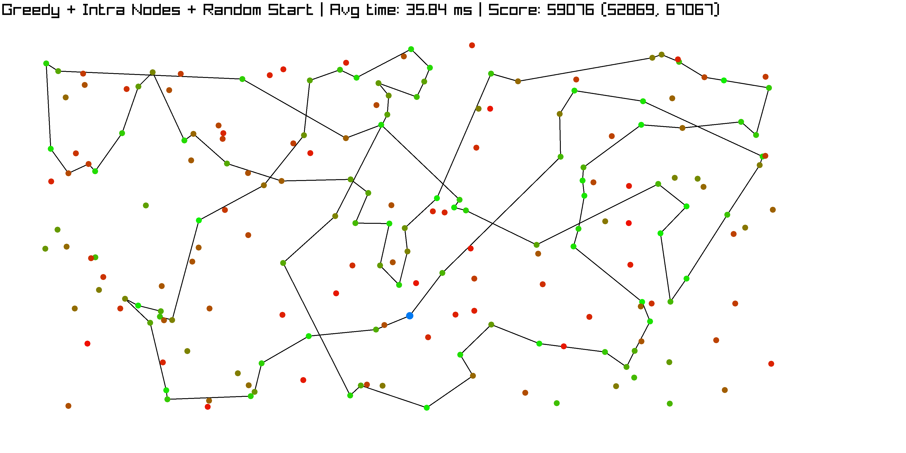

\newpage

#### Intra Nodes + Greedy Start

122, 107, 40, 100, 63, 135, 38, 27, 16, 1, 156, 198, 117, 193, 31, 54, 73, 136, 190, 80, 162, 175, 78, 142, 45, 5, 177, 36, 61, 91, 141, 77, 81, 153, 187, 163, 89, 127, 137, 114, 103, 113, 180, 176, 194, 166, 86, 185, 95, 130, 99, 22, 179, 66, 94, 47, 148, 60, 20, 28, 149, 4, 140, 183, 152, 170, 34, 55, 18, 62, 124, 106, 143, 35, 109, 0, 29, 160, 33, 138, 182, 11, 139, 168, 195, 145, 15, 3, 70, 13, 132, 169, 188, 6, 147, 191, 90, 51, 121, 131, 122

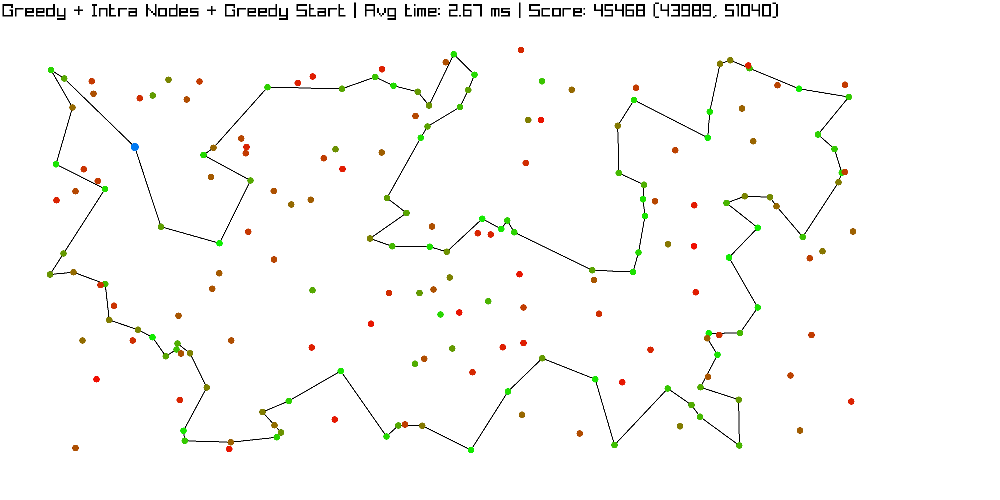

\newpage

#### Intra Edges + Random Init

3, 15, 145, 195, 168, 139, 11, 182, 138, 33, 160, 29, 0, 109, 35, 143, 106, 124, 62, 18, 55, 183, 140, 28, 20, 60, 148, 47, 94, 66, 179, 185, 95, 86, 166, 194, 176, 113, 114, 137, 127, 165, 89, 103, 163, 187, 146, 153, 81, 77, 141, 82, 111, 144, 104, 8, 87, 21, 91, 61, 36, 177, 5, 78, 175, 142, 45, 80, 190, 193, 31, 54, 117, 198, 156, 1, 131, 121, 118, 74, 98, 51, 191, 90, 122, 135, 102, 63, 40, 107, 133, 10, 178, 147, 6, 188, 169, 132, 13, 70, 3

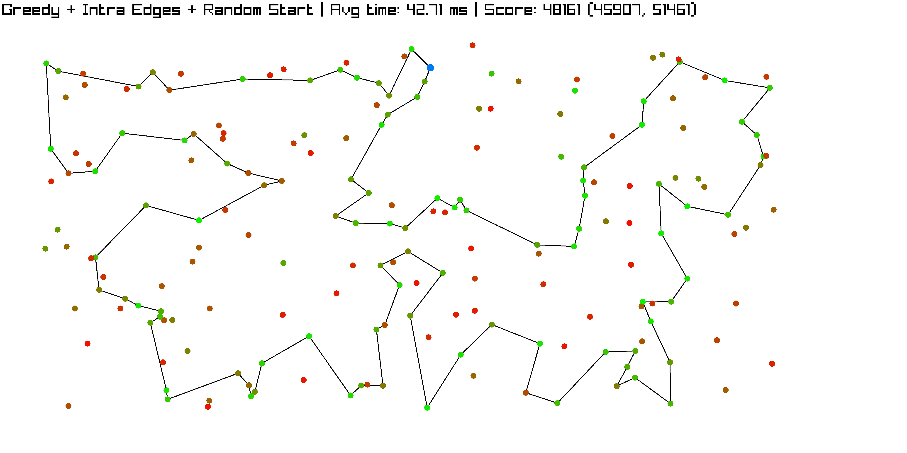
\newpage

#### Intra Edges + Greedy Start

90, 122, 107, 40, 63, 135, 38, 27, 16, 1, 156, 198, 117, 193, 31, 54, 164, 73, 136, 190, 80, 162, 175, 78, 142, 45, 5, 177, 36, 61, 91, 141, 77, 81, 153, 187, 163, 89, 127, 103, 113, 176, 194, 166, 86, 95, 130, 99, 22, 185, 179, 66, 94, 47, 148, 60, 20, 28, 149, 4, 140, 183, 152, 170, 34, 55, 18, 62, 124, 106, 143, 35, 109, 0, 29, 160, 33, 144, 111, 82, 21, 8, 104, 138, 182, 11, 139, 168, 195, 145, 15, 3, 70, 13, 132, 169, 188, 6, 147, 51, 90

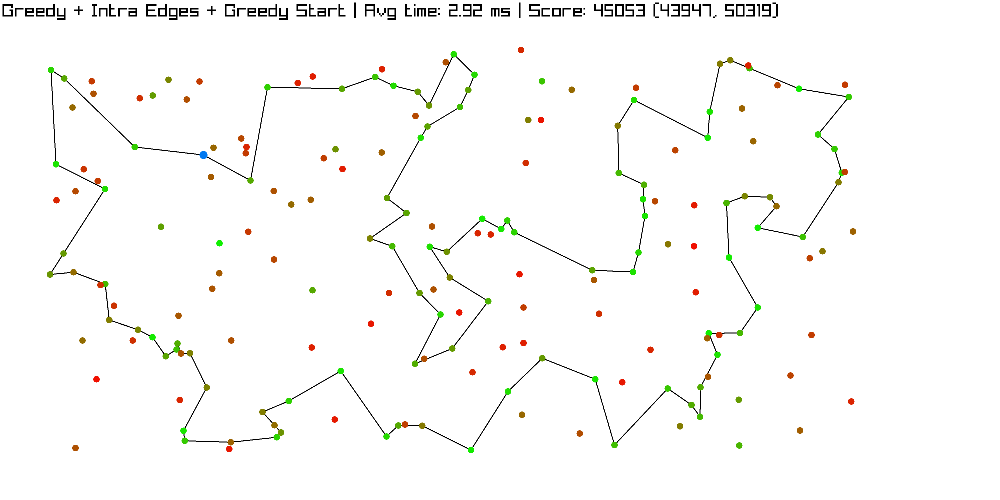

\newpage

### Local Search Steepest

#### Intra Nodes + Random Start

190, 164, 73, 136, 45, 175, 78, 5, 36, 61, 177, 25, 51, 125, 191, 90, 122, 135, 63, 38, 27, 1, 156, 198, 117, 193, 31, 54, 182, 139, 134, 118, 121, 112, 131, 147, 6, 188, 169, 132, 70, 3, 155, 152, 28, 140, 183, 95, 86, 194, 166, 179, 94, 47, 148, 20, 55, 18, 62, 124, 106, 34, 170, 189, 15, 145, 13, 195, 168, 11, 138, 33, 111, 81, 153, 77, 82, 8, 104, 160, 29, 0, 109, 35, 143, 163, 165, 127, 89, 103, 114, 113, 176, 185, 22, 99, 130, 187, 141, 80, 190

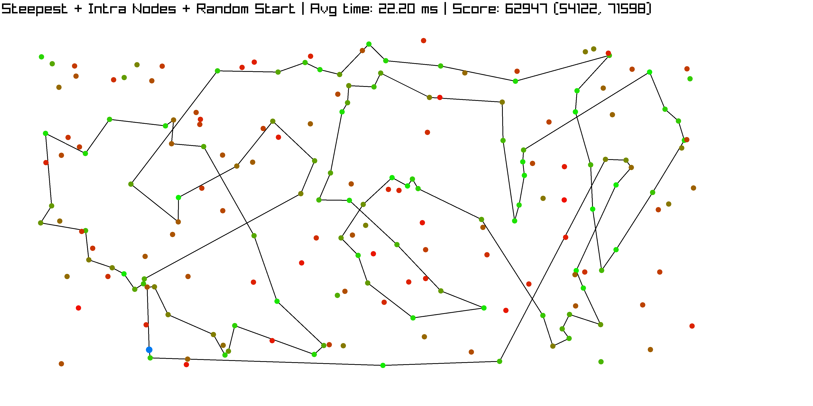

\newpage

#### Intra Nodes + Greedy Start

121, 51, 90, 191, 147, 6, 188, 169, 132, 13, 70, 3, 15, 145, 195, 168, 139, 11, 138, 33, 160, 29, 0, 109, 35, 143, 106, 124, 62, 18, 55, 34, 170, 152, 183, 140, 4, 149, 28, 20, 60, 148, 47, 94, 66, 179, 185, 22, 99, 130, 95, 86, 166, 194, 176, 113, 103, 127, 89, 163, 187, 153, 81, 77, 141, 91, 36, 61, 21, 82, 111, 8, 104, 177, 5, 45, 142, 78, 175, 162, 80, 190, 136, 73, 54, 31, 193, 117, 198, 156, 1, 16, 27, 38, 135, 63, 40, 107, 122, 131, 121

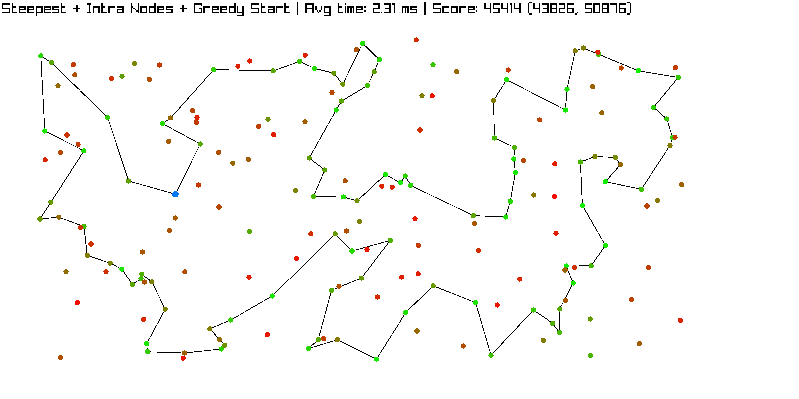

\newpage

#### Intra Edges + Random Init

98, 51, 125, 191, 90, 122, 135, 102, 63, 40, 107, 133, 10, 147, 134, 6, 188, 169, 132, 13, 70, 3, 15, 145, 195, 168, 43, 139, 11, 138, 33, 160, 144, 104, 8, 82, 111, 35, 109, 0, 29, 189, 155, 184, 152, 170, 34, 55, 18, 62, 124, 106, 86, 185, 95, 183, 140, 28, 20, 148, 47, 94, 66, 179, 166, 194, 176, 113, 103, 127, 89, 163, 153, 81, 77, 141, 91, 36, 61, 21, 177, 5, 78, 175, 45, 80, 190, 136, 73, 54, 31, 193, 117, 198, 156, 27, 38, 1, 131, 121, 98

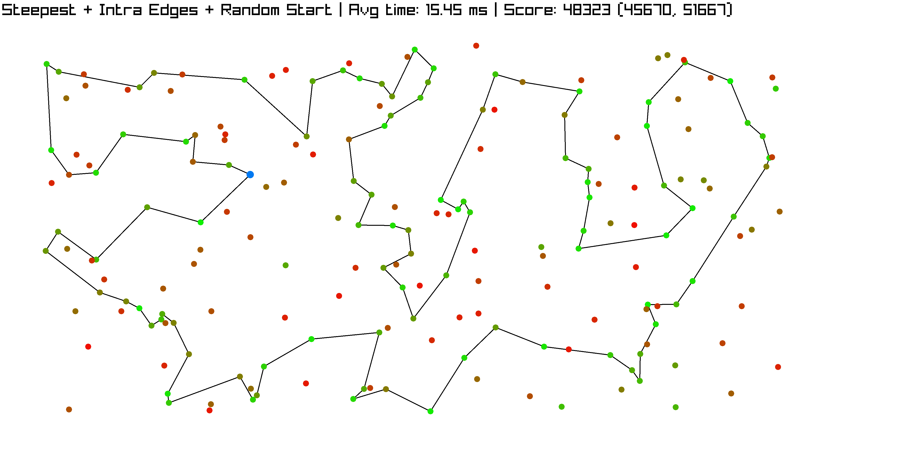
\newpage

#### Intra Edges + Greedy Start

40, 107, 133, 122, 135, 131, 121, 51, 90, 191, 147, 6, 188, 169, 132, 13, 70, 3, 15, 145, 195, 168, 139, 11, 182, 138, 33, 160, 29, 0, 109, 35, 143, 106, 124, 62, 18, 55, 34, 170, 152, 183, 140, 4, 149, 28, 20, 60, 148, 47, 94, 66, 179, 22, 99, 130, 95, 185, 86, 166, 194, 176, 180, 113, 103, 114, 137, 127, 89, 163, 187, 153, 81, 77, 141, 91, 61, 36, 177, 5, 45, 142, 78, 175, 162, 80, 190, 136, 73, 54, 31, 193, 117, 198, 156, 1, 16, 27, 38, 63, 40

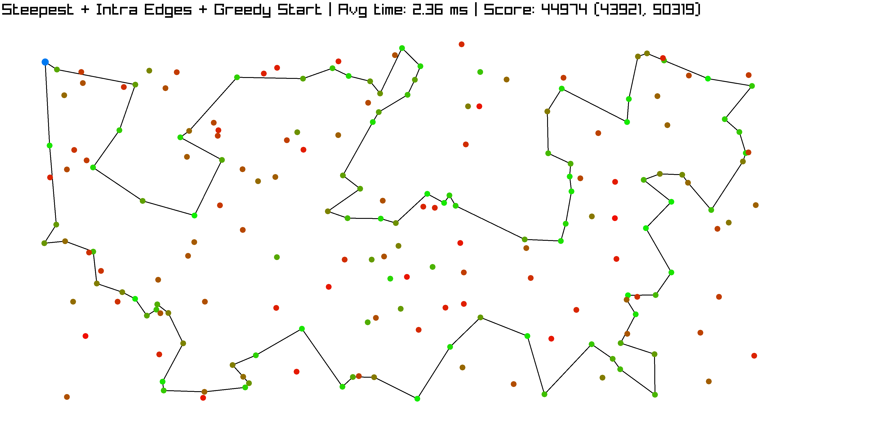

\newpage

All solutions were checked with solution checker.

# Conclusions

- Steepest algorithm achieved better results, run faster and was easier to implement than greedy in this problem instance
- Starting from greedy-produced solution consistently gave better results than random
- Local search seems to dominate all other methods on both TSPA and TSPB
- Steepest approach with intra-edge moves and greedy start produces the lowerst overall result among every other method.