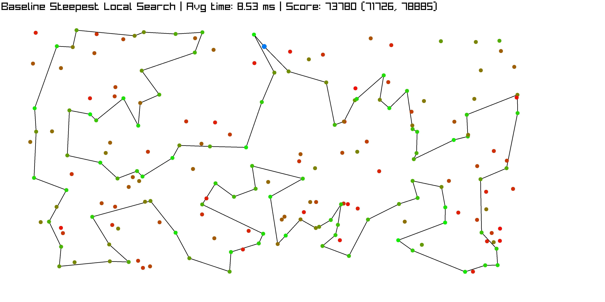
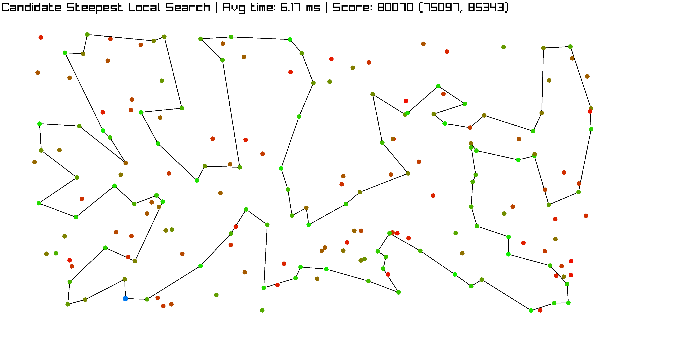
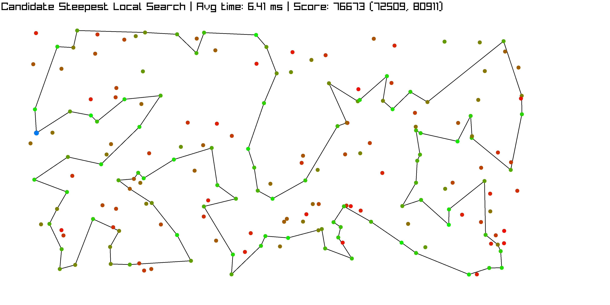
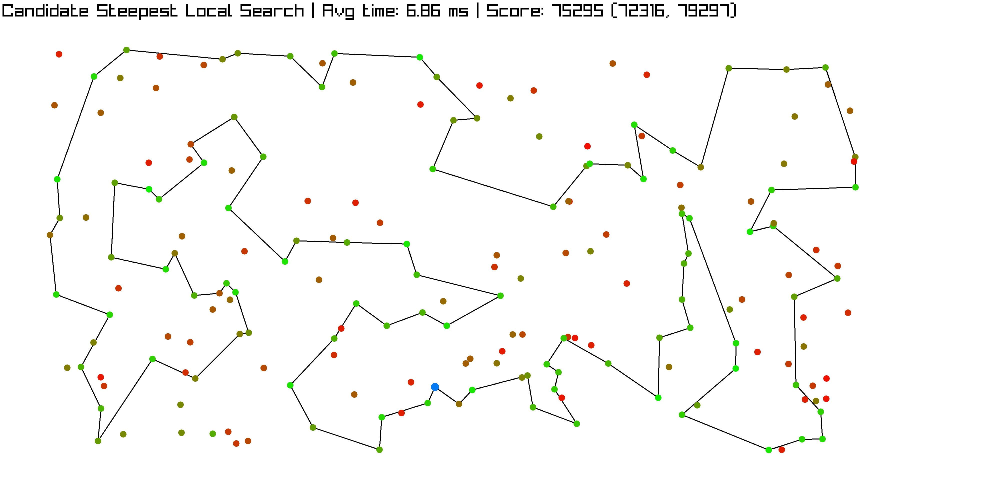
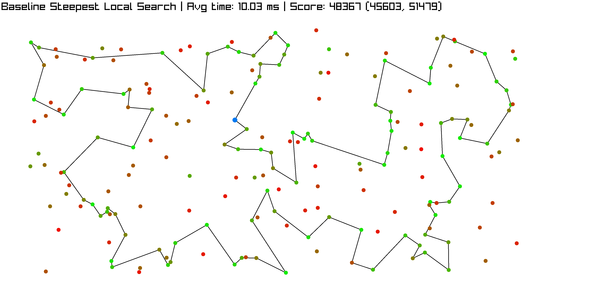
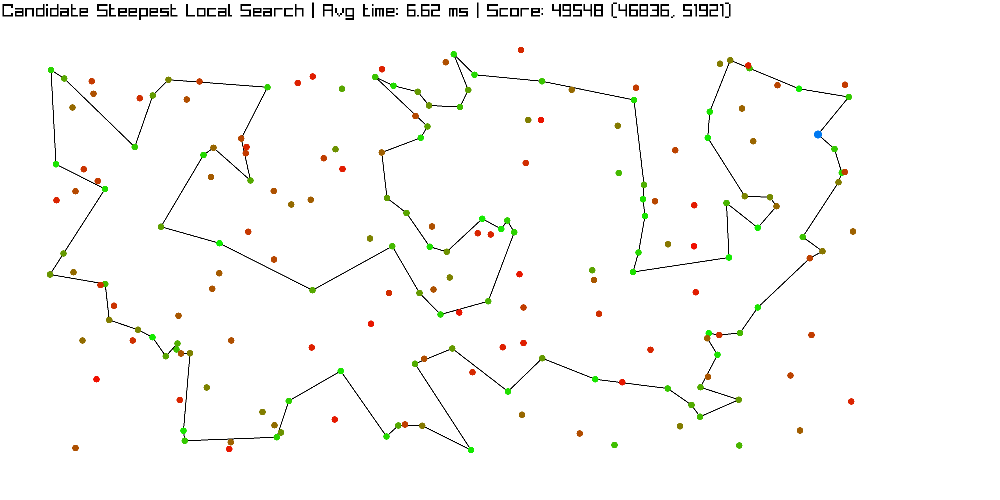
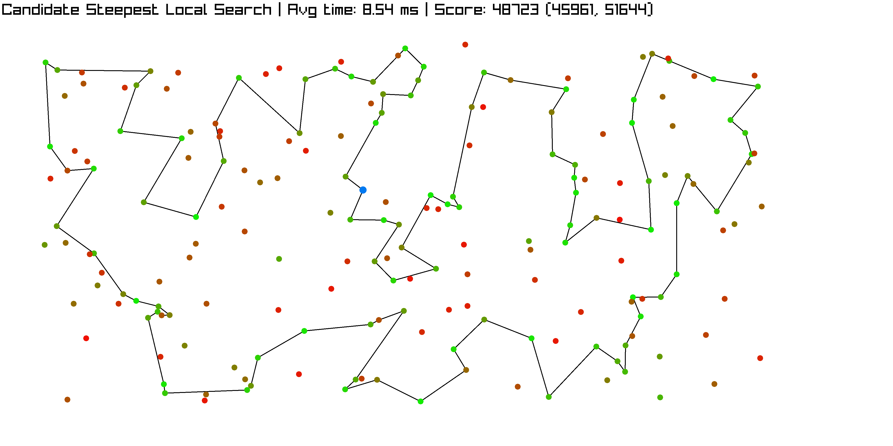
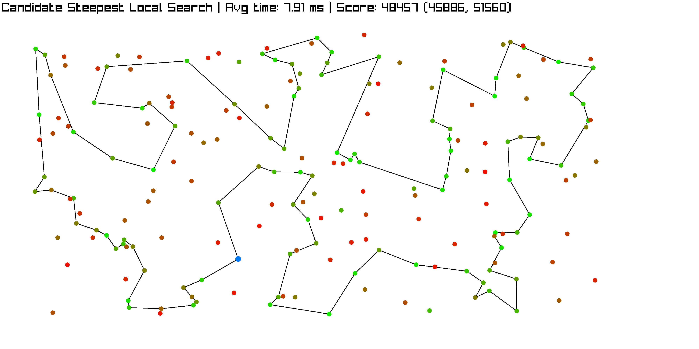

---
geometry: margin=10mm
fontsize: 4pt
...

# Report Laboratories 4

Maciej Janicki 156073
Jakub Kubiak 156049

[Source code](https://github.com/majanicki/ec/tree/trunk/lab04)

# Problem Description

Given a set of nodes, each having a set of coordinates ($x$, $y$) and inherent cost, pick exactly half of the nodes to form a Hamiltonian cycle.

The goal is to minimze the sum of total path length plus the total cost of the selected nodes.

Current implementation is about improving the efficiency of the steepest local search with the use of candidate moves.

# Pseudocode

## Common Functionality

```
FUNCTION get_move_delta(move, solution, dataset, dist):
    SWITCH move.kind:
        CASE INTER_ROUTE:
            candidate := dataset[move.dataset_index]
            prev_node := solution[move.solution_index - 1
                        if move.solution_index > 0 else solution.size - 1]
            swap_out_node := solution[move.solution_index]
            next_node := solution[(move.solution_index + 1) % solution.size]
            old_cost := dist(prev_node, swap_out_node) +
                        dist(swap_out_node, next_node) + swap_out_node.cost
            new_cost := dist(prev_node, candidate) +
                        dist(candidate, next_node) + candidate.cost
            RETURN new_cost - old_cost

        CASE INTRA_ROUTE_NODE_EXCHANGE:
            node_a := solution[move.swap_index_a]
            node_b := solution[move.swap_index_b]
            prev_a := solution[move.swap_index_a - 1
                        if move.swap_index_a > 0 else solution.size - 1]
            next_a := solution[(move.swap_index_a + 1) % solution.size]
            prev_b := solution[move.swap_index_b - 1
                        if move.swap_index_b > 0 else solution.size - 1]
            next_b := solution[(move.swap_index_b + 1) % solution.size]
            IF next_a.id == node_b.id OR next_b.id == node_a.id:
                old_cost := dist(prev_a, node_a) +
                            dist(node_a, node_b) + dist(node_b, next_b)
                new_cost := dist(prev_a, node_b)
                            + dist(node_b, node_a) + dist(node_a, next_b)
            ELSE:
                old_cost := dist(prev_a, node_a) + dist(node_a, next_a)
                            + dist(prev_b, node_b) + dist(node_b, next_b)
                new_cost := dist(prev_a, node_b) + dist(node_b, next_a)
                            + dist(prev_b, node_a) + dist(node_a, next_b)
            RETURN new_cost - old_cost

        CASE INTRA_ROUTE_EDGE_EXCHANGE:
            a := move.swap_index_a
            b := move.swap_index_b
            c := (a + 1) % solution.size
            d := (b + 1) % solution.size
            node_a := solution[a]
            node_b := solution[b]
            node_c := solution[c]
            node_d := solution[d]
            old_cost := dist(node_a, node_c) + dist(node_b, node_d)
            new_cost := dist(node_a, node_b) + dist(node_c, node_d)
            RETURN new_cost - old_cost

FUNCTION act_on_move(move, solution, dataset, used):
    IF NOT move.valid: RETURN false
    SWITCH move.kind:
        CASE INTER_ROUTE:
            used[solution[move.solution_index].id] := false
            used[move.dataset_index] := true
            solution[move.solution_index] := dataset[move.dataset_index]
        CASE INTRA_ROUTE_NODE_EXCHANGE:
            SWAP(solution[move.swap_index_a], solution[move.swap_index_b])
        CASE INTRA_ROUTE_EDGE_EXCHANGE:
            a := move.swap_index_a
            b := move.swap_index_b
            IF a < b:
                REVERSE(solution[a+1 to b])
            ELSE:
                segment := solution[a+1 to end] + solution[0 to b]
                REVERSE(segment)
                FOR i IN 0 to segment.size - 1:
                    solution[(a+1+i) % solution.size] := segment[i]
    RETURN true
```

## Candidate moves

```
FUNCTION precompute_nearest_neighbors_inter(dataset, dist, n_candidates):
    n := dataset.size
    neighbors := vector of n empty vectors

    FOR i IN 0 to n-1:
        queue := empty list
        FOR j IN 0 to n-1:
            IF i == j: CONTINUE
            cost := dist(dataset[i], dataset[j]) + dataset[j].cost
            ADD (cost, j) TO queue

        KEEP n_candidates smallest elements in queue by cost

        FOR each (cost, idx) IN first n_candidates of queue:
            ADD idx TO neighbors[i]

    RETURN neighbors


FUNCTION get_best_move_candidate(solution, dataset, dist, used,
                                  inter_neighbors, n_candidates):
    best_move.valid := false
    best_delta := 0

    FOR i IN 0 to solution.size - 1:
        candidate_node := solution[i]

        FOR j IN inter_neighbors[candidate_node.id]:
            IF used[j]:
              move := INTRA_EDGE_EXCHANGE_MOVE(i, j)
            ELSE:
              move := INTER_ROUTE_MOVE(i, j)
            delta := get_move_delta(move, solution, dataset, dist)
            IF delta < best_delta:
                best_move := move
                best_delta := delta
    RETURN best_move

FUNCTION get_local_search_candidate(solution, dataset, dist, n_candidates):
    used := array(dataset.size) initialized false
    FOR node IN solution:
        used[node.id] := true

    WHILE true:
        move := get_best_move_candidate(solution, dataset, dist, used, n_candidates)
        IF NOT act_on_move(move, solution, dataset, used):
            BREAK

    RETURN solution
```

# Result Comparison

| Algorithm                                          | TSPA Cost (Mean (Min, Max)) | TSPB Cost (Mean (Min, Max)) |
| -------------------------------------------------- | --------------------------- | --------------------------- |
| Random                                             | 265,135 (241,347, 291,966)  | 213,771 (190,834, 241,363)  |
| Nearest Neighbor #1                                | 85,108.5 (83,182, 89,433)   | 54,390.4 (52,319, 59,030)   |
| Nearest Neighbor #2                                | 73,601.7 (71,868, 75,953)   | 48,723.2 (44,609, 57,315)   |
| Greedy Cycle                                       | 72,646.4 (71,488, 74,410)   | 51,400.6 (49,001, 57,324)   |
| Nearest Neighbor Regret                            | 117,516 (107,945, 128,071)  | 73,512.7 (67,345, 78,889)   |
| Greedy Cycle Regret                                | 115,137 (106,052, 123,750)  | 73,316.1 (67,729, 77,498)   |
| Nearest Neighbor Regret Weighted (0.5, 0.5)        | 73,566.7 (70,894, 75,929)   | 49,847 (44,901, 57,036)     |
| Greedy Cycle Regret Weighted (0.5, 0.5)            | 72,137.6 (71,108, 73,395)   | 50,827.2 (47,144, 55,700)   |
| Nearest Neighbor Regret Weighted (0.3, 0.7)        | 75,562.1 (72,155, 78,661)   | 51,784.2 (47,543, 59,409)   |
| Greedy Cycle Regret Weighted (0.3, 0.7)            | 73,010.6 (70,475, 75,365)   | 52,420.1 (49,944, 56,179)   |
| Nearest Neighbor Regret Weighted (0.7, 0.3)        | 73,412.8 (71,519, 75,234)   | 48,816.6 (45,153, 53,425)   |
| Greedy Cycle Regret Weighted (0.7, 0.3)            | 72,437.2 (71,163, 73,759)   | 51,173.3 (49,326, 53,437)   |
| Local Search Greedy + Intra Nodes + Random Start   | 83,804.35 (77,418, 90,972)  | 59,076.75 (52,869, 67,067)  |
| Local Search Greedy + Intra Nodes + Greedy Start   | 72,806.49 (71,034, 74,987)  | 45,468.38 (43,989, 51,040)  |
| Local Search Greedy + Intra Edges + Random Start   | 73,387.63 (71,248, 78,480)  | 48,161.21 (45,907, 51,461)  |
| Local Search Greedy + Intra Edges + Greedy Start   | 71,067.07 (70,046, 73,486)  | 45,053.77 (43,947, 50,319)  |
| Local Search Steepest + Intra Nodes + Random Start | 87,883.71 (79,593, 98,325)  | 62,947.23 (54,122, 71,598)  |
| Local Search Steepest + Intra Nodes + Greedy Start | 72,807.32 (71,034, 74,904)  | 45,414.50 (43,826, 50,876)  |
| **Local Search Steepest + Intra Edges + Random Start** | **73,938.93 (71,428, 77,903)**  | **48,323.99 (45,670, 51,667)**  |
| Local Search Steepest + Intra Edges + Greedy Start | 70,975.96 (69,864, 73,068)  | 44,974.89 (43,921, 50,319)  |
| **Candidate Local Search Steepest (k=10)**             | **80,070.30 (75,097, 85,343)**  | **49,548.59 (46,836, 51,921)**  |
| **Candidate Local Search Steepest (k=15)**             | **76,673.52 (72,509, 80,911)**  | **48,723.89 (45,961, 51,644)**  |
| **Candidate Local Search Steepest (k=20)**             | **75,295.08 (72,316, 79,297)**  | **48,457.54 (45,886, 51,560)**  |

\newpage

# Execution Time Comparison

| Algorithm                                          | TSPA Time (Mean (Min, Max)) [ms] | TSPB Time (Mean (Min, Max)) [ms] |
| -------------------------------------------------- | -------------------------------- | -------------------------------- |
| Local Search Greedy + Intra Nodes + Random Start   | 36.36 (16.00, 69.92)             | 35.84 (19.78, 59.54)             |
| Local Search Greedy + Intra Nodes + Greedy Start   | 2.49 (1.80, 5.13)                | 2.67 (1.85, 7.62)                |
| Local Search Greedy + Intra Edges + Random Start   | 48.81 (23.56, 70.97)             | 42.71 (22.79, 62.96)             |
| Local Search Greedy + Intra Edges + Greedy Start   | 3.28 (1.95, 5.24)                | 2.92 (1.77, 7.81)                |
| Local Search Steepest + Intra Nodes + Random Start | 21.89 (16.96, 31.65)             | 22.20 (17.60, 29.57)             |
| Local Search Steepest + Intra Nodes + Greedy Start | 2.10 (1.55, 3.00)                | 2.31 (1.81, 4.95)                |
| **Local Search Steepest + Intra Edges + Random Start** | **15.45 (13.59, 19.09)**             | **15.45 (13.17, 17.90)             |
| Local Search Steepest + Intra Edges + Greedy Start | 2.78 (1.83, 3.85)                | 2.36 (1.86, 4.88)                |
| **Candidate Local Search Steepest (k=10)**             | **4.31 (3.09, 7.61)**                | **3.97 (3.26, 9.21)**                |
| **Candidate Local Search Steepest (k=15)**             | **4.21 (3.74, 4.73)**                | **4.17 (3.68, 4.62)**                |
| **Candidate Local Search Steepest (k=20)**             | **4.92 (4.20, 8.74)**                | **4.47 (3.86, 5.23)**                |

\newpage

# Visualizations

## TSPA

### Steepest Local Search + Intra Edges + Random Start

89, 183, 23, 137, 176, 51, 118, 59, 65, 116, 43, 42, 181, 159, 193, 41, 139, 115, 198, 46, 68, 0, 143, 117, 93, 140, 108, 69, 18, 22, 146, 34, 160, 54, 177, 10, 4, 112, 84, 184, 149, 123, 127, 70, 135, 154, 180, 162, 151, 133, 79, 80, 94, 63, 158, 53, 121, 100, 26, 97, 152, 1, 101, 86, 75, 2, 129, 92, 57, 179, 145, 78, 120, 44, 16, 171, 175, 113, 31, 196, 81, 90, 27, 165, 40, 185, 55, 52, 106, 178, 14, 49, 102, 144, 62, 9, 37, 148, 15, 186, 89



### Candidate Moves approach (k=10)

4, 84, 190, 10, 177, 184, 35, 65, 116, 43, 42, 160, 34, 181, 146, 22, 159, 96, 41, 193, 18, 69, 108, 140, 93, 46, 139, 115, 59, 118, 51, 0, 117, 143, 183, 89, 23, 137, 176, 80, 79, 122, 63, 94, 124, 167, 148, 15, 9, 62, 144, 14, 102, 49, 32, 138, 165, 39, 7, 164, 27, 107, 90, 81, 196, 40, 185, 106, 3, 178, 52, 55, 57, 92, 145, 78, 31, 113, 175, 171, 16, 25, 44, 120, 2, 152, 97, 1, 101, 75, 86, 53, 180, 154, 135, 133, 151, 162, 123, 112, 4



### Candidate Moves approach (k=15)

146, 22, 18, 69, 108, 93, 117, 0, 143, 183, 89, 23, 137, 176, 80, 79, 63, 94, 148, 37, 15, 9, 62, 144, 102, 49, 14, 138, 164, 27, 90, 81, 40, 119, 165, 185, 106, 178, 52, 55, 57, 129, 92, 78, 145, 196, 31, 56, 113, 175, 171, 16, 44, 120, 2, 152, 97, 1, 101, 75, 86, 26, 53, 180, 154, 70, 135, 162, 133, 151, 51, 59, 65, 116, 105, 43, 77, 149, 123, 127, 112, 4, 84, 35, 184, 190, 10, 177, 54, 48, 160, 34, 181, 42, 115, 46, 139, 41, 193, 159, 146



### Candidate Moves approach (k=20)

180, 154, 135, 70, 127, 123, 162, 151, 133, 79, 63, 94, 80, 176, 51, 118, 59, 115, 46, 68, 110, 139, 41, 193, 159, 181, 42, 5, 43, 105, 116, 65, 149, 131, 35, 184, 10, 177, 54, 160, 34, 103, 146, 22, 18, 108, 140, 93, 117, 0, 143, 183, 89, 186, 23, 137, 148, 9, 62, 102, 49, 144, 14, 138, 21, 7, 164, 27, 90, 165, 185, 40, 81, 196, 31, 113, 175, 171, 16, 44, 78, 145, 106, 178, 52, 55, 57, 92, 129, 120, 2, 152, 97, 1, 101, 75, 86, 26, 53, 158, 180



## TSPB

### Steepest Local Search + Intra Edges + Random Start

139, 11, 182, 138, 33, 160, 144, 111, 29, 0, 109, 35, 106, 124, 62, 18, 55, 34, 152, 183, 140, 149, 28, 20, 148, 47, 94, 66, 179, 185, 99, 130, 95, 86, 166, 194, 88, 176, 180, 113, 103, 114, 137, 127, 165, 89, 163, 187, 146, 153, 81, 77, 82, 8, 21, 141, 91, 61, 36, 177, 5, 78, 175, 45, 80, 190, 136, 73, 54, 31, 193, 117, 198, 1, 131, 121, 51, 125, 191, 90, 122, 135, 63, 100, 40, 107, 133, 147, 134, 6, 188, 169, 132, 70, 3, 15, 145, 13, 195, 168, 139



### Candidate Moves approach (k=10)

148, 47, 94, 66, 179, 172, 52, 166, 194, 88, 176, 180, 113, 103, 114, 127, 89, 163, 153, 81, 77, 82, 21, 141, 91, 61, 36, 177, 5, 175, 80, 190, 73, 164, 31, 54, 193, 117, 198, 156, 1, 27, 38, 135, 63, 40, 107, 122, 133, 10, 147, 71, 51, 191, 90, 131, 121, 25, 138, 104, 8, 111, 35, 109, 0, 29, 160, 33, 11, 139, 43, 168, 195, 188, 169, 132, 13, 145, 15, 70, 3, 155, 152, 55, 18, 62, 124, 106, 86, 95, 185, 22, 99, 130, 183, 140, 149, 28, 20, 60, 148



### Candidate Moves approach (k=15)

11, 138, 33, 160, 104, 8, 111, 144, 29, 0, 35, 109, 189, 155, 184, 152, 170, 34, 55, 18, 62, 124, 106, 128, 86, 95, 183, 140, 149, 28, 20, 60, 148, 47, 94, 179, 99, 185, 166, 194, 176, 113, 103, 127, 89, 163, 187, 153, 81, 77, 97, 141, 91, 36, 61, 82, 87, 21, 177, 5, 78, 175, 80, 190, 193, 31, 164, 73, 54, 117, 198, 1, 38, 135, 102, 63, 40, 107, 10, 133, 122, 90, 131, 121, 51, 71, 147, 134, 6, 188, 169, 132, 70, 3, 15, 145, 13, 195, 168, 139, 11



### Candidate Moves approach (k=20)

177, 5, 45, 142, 78, 175, 162, 80, 190, 136, 73, 54, 31, 193, 117, 198, 156, 1, 16, 27, 38, 63, 40, 107, 100, 135, 131, 121, 51, 191, 90, 122, 133, 147, 134, 139, 11, 168, 195, 132, 169, 188, 70, 3, 15, 145, 155, 29, 0, 109, 35, 106, 124, 62, 18, 55, 34, 152, 183, 140, 149, 28, 20, 60, 148, 47, 94, 179, 185, 99, 130, 95, 86, 166, 194, 176, 180, 113, 103, 114, 137, 127, 165, 89, 163, 153, 81, 77, 141, 36, 61, 21, 82, 8, 104, 160, 33, 138, 182, 25, 177



All solutions were checked with solution checker.

# Conclusions

- Evaluating only a subset of 'nearest' neighbors is enough to capture the good moves
- Candidate approach might be a good alternative for the greedy approaches, especially for larger instances, where the number of neighbors to evaluate is too large to be feasible.
- Execution speed of the candidate search heavily relies on implementation details, whether candidates are cached and datastructures used to sort them
- When the number of candidates increases, results improve at expense of execution time.
