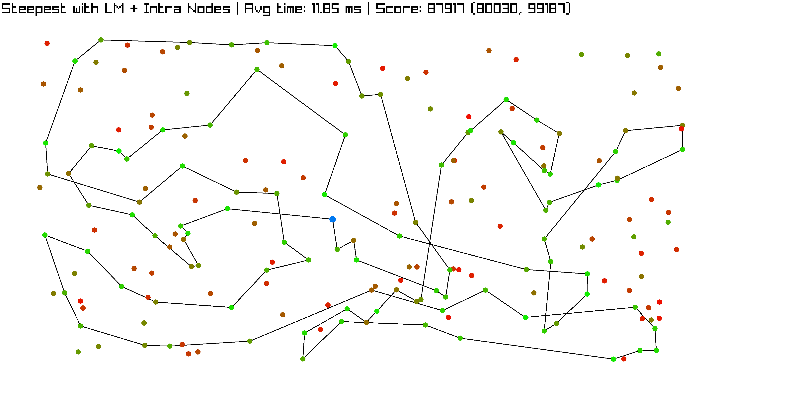
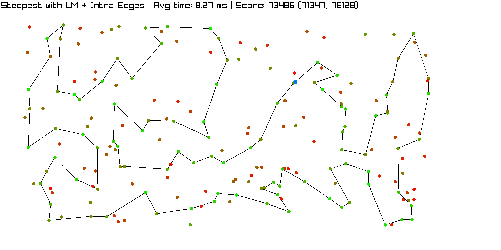
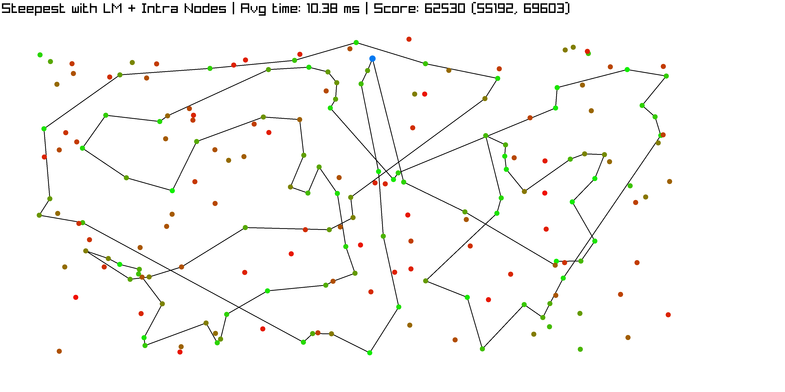
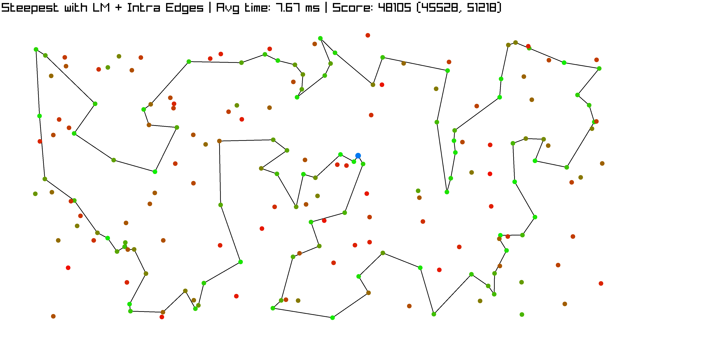

---
geometry: margin=10mm
fontsize: 4pt
...

# Report Laboratories 5

Maciej Janicki 156073
Jakub Kubiak 156049

[Source code](https://github.com/majanicki/ec/tree/trunk/lab05)

# Problem Description

Given a set of nodes, each having a set of coordinates ($x$, $y$) and inherent cost, pick exactly half of the nodes to form a Hamiltonian cycle.

The goal is to minimze the sum of total path length plus the total cost of the selected nodes.

Current implementation is about improving the efficiency of the steepest local search with the use of evaluations from previous moves.

# Pseudocode

## Steepest with LM

```
FUNCTION update_lm(solution, dataset, dist, used, affected_nodes, lm):
    FOR i IN 0...affected_nodes.size() - 1:
        FOR j IN 0...dataset.size() - 1:
            IF used[i] THEN CONTINUE 
            m := inter_route_move(affected_nodes[i].id, j) 
            delta := get_move_delta(m, solution, dataset, dist) 

            m_inverted := inter_route_move(j, affected_nodes[i].id)
            delta_inverted := get_move_delta(m, solution, dataset, dist)
            IF delta < 0:
                new_entry.delta := delta
                new_entry.removed_edges := get_removed_edges(m, solution)
                new_entry.move := m
                lm.push_back(m)

    FOR i IN 0...affected_nodes.size() - 1:
        FOR j IN 0...solution.size() - 1:
            IF neighbors(affected_nodes[i], solution[j]) => CONTINUE

            m := intra_route(affected_nodes[i].id, solution[j].id)
            delta := get_move_delta(m, solution, dataset, dist)

            IF delta < 0:
                new_entry.delta := delta
                new_entry.removed_edges := get_removed_edges(m, solution)
                new_entry.move := m
                lm.push_back(m)
    sort(lm)
```

```
FUNCTION check_valid(removed_edges, solution):
    normal_valid := TRUE
    FOREACH edge IN removed_edges:
        IF edge NOT IN solution:
            normal_valid := FALSE
            BREAK
    inverse_valid := TRUE
    FOREACH edge IN removed_edges:
        edge = inverse(edge)
        IF edge NOT IN solution:
            inverse_valid := FALSE
            BREAK
    IF normal_valid RETURN EDGES_SAME
    IF inverse_valid RETURN EDGES_REVERSED
    RETURN EDGES_MISSING
```

```
FUNCTION apply_move(entry.move, solution, used):
    SWITCH move.kind:
        CASE INTER_ROUTE:
            used[move.id_a] := false
            used[move.id_b] := true
            solution_index := get_node_pos(move.id_a, solution)
            solution[solution_index] := dataset[move.id_b]
            RETURN LIST[dataset[move.id_a]]

        CASE INTRA_ROUTE_EDGE_EXCHANGE:
            a := get_node_pos(move.id_a, solution)
            b := get_node_pos(move.id_b, solution)
            IF a < b:
                REVERSE(solution[a+1 to b])
            ELSE:
                segment := solution[a+1 to end] + solution[0 to b]
                REVERSE(segment)
                FOR i IN 0 to segment.size - 1:
                    solution[(a+1+i) % solution.size] := segment[i]
            RETURN solution[b to a]
```

```
FUNCTION apply_lm(lm, solution, used):
    FOREACH entry in lm;
        status := check_valid(entry.removed_edges, solution)
        SWITCH status:
            CASE EDGES_SAME:
                affected_nodes := apply_move(entry.move, solution, used)
                RETURN affected_nodes
            CASE EDGES_REVERSED:
                CONTINUE
            CASE EDGES_MISSING:
                REMOVE entry FROM lm
    RETURN empty
```

```
FUNCTION get_local_search_steepest_with_LM(solution, dataset, dist):
    used := nodes IN solution
    lm := EMPTY
    progressed := TRUE
    affected_nodes := nodes IN solution

    WHILE progressed:
        update_lm(solution, dataset, dist, used, affected_nodes, lm)
        affected_nodes := browse_LM_and_apply(lm, solution, used, dataset):
        IF affected_nodes is EMPTY:
            break

    RETURN solution
```

# Result Comparison

| Algorithm                                          | TSPA Cost (Mean (Min, Max)) | TSPB Cost (Mean (Min, Max)) |
| -------------------------------------------------- | --------------------------- | --------------------------- |
| Random                                             | 265,135 (241,347, 291,966)  | 213,771 (190,834, 241,363)  |
| Nearest Neighbor #1                                | 85,108.5 (83,182, 89,433)   | 54,390.4 (52,319, 59,030)   |
| Nearest Neighbor #2                                | 73,601.7 (71,868, 75,953)   | 48,723.2 (44,609, 57,315)   |
| Greedy Cycle                                       | 72,646.4 (71,488, 74,410)   | 51,400.6 (49,001, 57,324)   |
| Nearest Neighbor Regret                            | 117,516 (107,945, 128,071)  | 73,512.7 (67,345, 78,889)   |
| Greedy Cycle Regret                                | 115,137 (106,052, 123,750)  | 73,316.1 (67,729, 77,498)   |
| Nearest Neighbor Regret Weighted (0.5, 0.5)        | 73,566.7 (70,894, 75,929)   | 49,847 (44,901, 57,036)     |
| Greedy Cycle Regret Weighted (0.5, 0.5)            | 72,137.6 (71,108, 73,395)   | 50,827.2 (47,144, 55,700)   |
| Nearest Neighbor Regret Weighted (0.3, 0.7)        | 75,562.1 (72,155, 78,661)   | 51,784.2 (47,543, 59,409)   |
| Greedy Cycle Regret Weighted (0.3, 0.7)            | 73,010.6 (70,475, 75,365)   | 52,420.1 (49,944, 56,179)   |
| Nearest Neighbor Regret Weighted (0.7, 0.3)        | 73,412.8 (71,519, 75,234)   | 48,816.6 (45,153, 53,425)   |
| Greedy Cycle Regret Weighted (0.7, 0.3)            | 72,437.2 (71,163, 73,759)   | 51,173.3 (49,326, 53,437)   |
| Local Search Greedy + Intra Nodes + Random Start   | 83,804.35 (77,418, 90,972)  | 59,076.75 (52,869, 67,067)  |
| Local Search Greedy + Intra Nodes + Greedy Start   | 72,806.49 (71,034, 74,987)  | 45,468.38 (43,989, 51,040)  |
| Local Search Greedy + Intra Edges + Random Start   | 73,387.63 (71,248, 78,480)  | 48,161.21 (45,907, 51,461)  |
| Local Search Greedy + Intra Edges + Greedy Start   | 71,067.07 (70,046, 73,486)  | 45,053.77 (43,947, 50,319)  |
| Local Search Steepest + Intra Nodes + Random Start | 87,883.71 (79,593, 98,325)  | 62,947.23 (54,122, 71,598)  |
| Local Search Steepest + Intra Nodes + Greedy Start | 72,807.32 (71,034, 74,904)  | 45,414.50 (43,826, 50,876)  |
| **Local Search Steepest + Intra Edges + Random Start** | **73,938.93 (71,428, 77,903)**  | **48,323.99 (45,670, 51,667)**  |
| Local Search Steepest + Intra Edges + Greedy Start | 70,975.96 (69,864, 73,068)  | 44,974.89 (43,921, 50,319)  |
| Candidate Local Search Steepest (k=10)             | 80,070.30 (75,097, 85,343)  | 49,548.59 (46,836, 51,921)  |
| Candidate Local Search Steepest (k=15)             | 76,673.52 (72,509, 80,911)  | 48,723.89 (45,961, 51,644)  |
| Candidate Local Search Steepest (k=20)             | 75,295.08 (72,316, 79,297)  | 48,457.54 (45,886, 51,560)  |
| Steepest with LM + Intra Nodes + Random Start      | 87,917.41 (80,030, 99,187)  | 62,530.10 (55,192, 69,603)  |
| **Steepest with LM + Intra Edges + Random Start**  | **73,486.72 (71,347, 76,128)**  | **48,105.17 (45,528, 51,218)**  |

\newpage

# Execution Time Comparison

| Algorithm                                          | TSPA Time (Mean (Min, Max)) [ms] | TSPB Time (Mean (Min, Max)) [ms] |
| -------------------------------------------------- | -------------------------------- | -------------------------------- |
| Local Search Greedy + Intra Nodes + Random Start   | 36.36 (16.00, 69.92)             | 35.84 (19.78, 59.54)             |
| Local Search Greedy + Intra Nodes + Greedy Start   | 2.49 (1.80, 5.13)                | 2.67 (1.85, 7.62)                |
| Local Search Greedy + Intra Edges + Random Start   | 48.81 (23.56, 70.97)             | 42.71 (22.79, 62.96)             |
| Local Search Greedy + Intra Edges + Greedy Start   | 3.28 (1.95, 5.24)                | 2.92 (1.77, 7.81)                |
| Local Search Steepest + Intra Nodes + Random Start | 21.89 (16.96, 31.65)             | 22.20 (17.60, 29.57)             |
| Local Search Steepest + Intra Nodes + Greedy Start | 2.10 (1.55, 3.00)                | 2.31 (1.81, 4.95)                |
| **Local Search Steepest + Intra Edges + Random Start** | **15.45 (13.59, 19.09)**             | **15.45 (13.17, 17.90)**             |
| Local Search Steepest + Intra Edges + Greedy Start | 2.78 (1.83, 3.85)                | 2.36 (1.86, 4.88)                |
| Candidate Local Search Steepest (k=10)             | 4.31 (3.09, 7.61)                | 3.97 (3.26, 9.21)                |
| Candidate Local Search Steepest (k=15)             | 4.21 (3.74, 4.73)                | 4.17 (3.68, 4.62)                |
| Candidate Local Search Steepest (k=20)             | 4.92 (4.20, 8.74)                | 4.47 (3.86, 5.23)                |
| Steepest with LM + Intra Nodes + Random Start      | 6.11 (4.44, 8.02)                | 6.43 (4.92, 12.67)               |
| **Steepest with LM + Intra Edges + Random Start**  | **4.87 (3.97, 6.03)**            | **4.63 (3.58, 6.56)**            |

\newpage

# Visualizations

## TSPA

### Steepest with LM + Intra Nodes + Random Start

80, 79, 122, 63, 97, 1, 152, 124, 186, 23, 89, 183, 143, 117, 93, 108, 18, 22, 146, 5, 115, 118, 51, 151, 133, 162, 123, 35, 184, 160, 34, 54, 177, 4, 112, 127, 136, 101, 2, 120, 31, 113, 175, 171, 16, 75, 86, 154, 70, 135, 180, 158, 53, 121, 100, 26, 148, 9, 62, 144, 14, 138, 106, 178, 49, 102, 55, 52, 185, 40, 90, 27, 39, 165, 57, 92, 44, 25, 78, 145, 129, 94, 176, 137, 0, 46, 139, 41, 193, 159, 195, 181, 42, 43, 131, 149, 47, 65, 116, 59, 80



### Steepest with LM + Intra Edges + Random Start

62, 9, 148, 124, 94, 63, 79, 133, 151, 162, 149, 131, 65, 116, 115, 59, 118, 51, 80, 176, 137, 23, 89, 183, 143, 117, 0, 46, 68, 139, 41, 193, 159, 69, 108, 18, 199, 22, 146, 34, 181, 42, 43, 35, 184, 160, 48, 54, 177, 10, 4, 112, 123, 127, 135, 154, 180, 53, 86, 75, 101, 100, 26, 97, 1, 152, 2, 120, 44, 25, 129, 92, 145, 78, 16, 171, 175, 113, 31, 196, 81, 90, 27, 164, 95, 39, 165, 119, 40, 185, 179, 57, 55, 52, 106, 178, 49, 102, 14, 144, 62



## TSPB

### Steepest with LM + Intra Nodes + Random Start

3, 35, 143, 180, 176, 194, 166, 86, 185, 99, 130, 95, 128, 62, 18, 55, 34, 124, 106, 81, 153, 187, 163, 89, 103, 113, 94, 47, 148, 60, 20, 140, 183, 109, 0, 168, 195, 13, 132, 169, 6, 191, 90, 122, 135, 131, 121, 51, 134, 43, 139, 182, 138, 11, 33, 8, 82, 87, 21, 177, 5, 78, 175, 45, 80, 190, 136, 164, 31, 54, 117, 198, 156, 193, 73, 173, 25, 104, 144, 160, 170, 152, 155, 70, 188, 147, 133, 63, 38, 27, 1, 36, 61, 91, 141, 77, 111, 29, 145, 15, 3



### Steepest with LM + Intra Edges + Random Start

109, 35, 111, 8, 82, 21, 61, 36, 141, 97, 77, 81, 153, 187, 163, 89, 127, 103, 113, 180, 176, 194, 166, 86, 95, 130, 99, 185, 179, 94, 47, 148, 60, 20, 28, 149, 4, 140, 183, 55, 18, 62, 124, 106, 34, 152, 155, 189, 3, 70, 15, 145, 168, 195, 13, 132, 169, 188, 6, 147, 191, 90, 125, 51, 121, 131, 135, 122, 107, 40, 63, 38, 1, 198, 117, 193, 31, 54, 164, 73, 136, 190, 80, 162, 45, 175, 78, 5, 177, 25, 74, 139, 11, 182, 138, 104, 33, 160, 29, 0, 109



All solutions were checked with solution checker.

# Conclusions

- 
