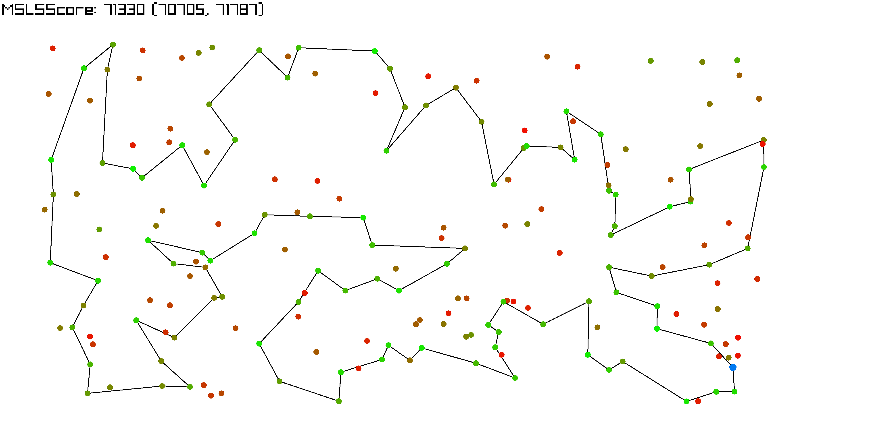
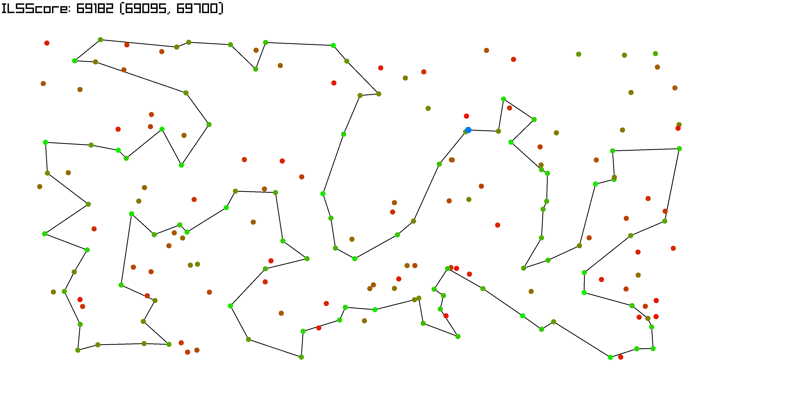
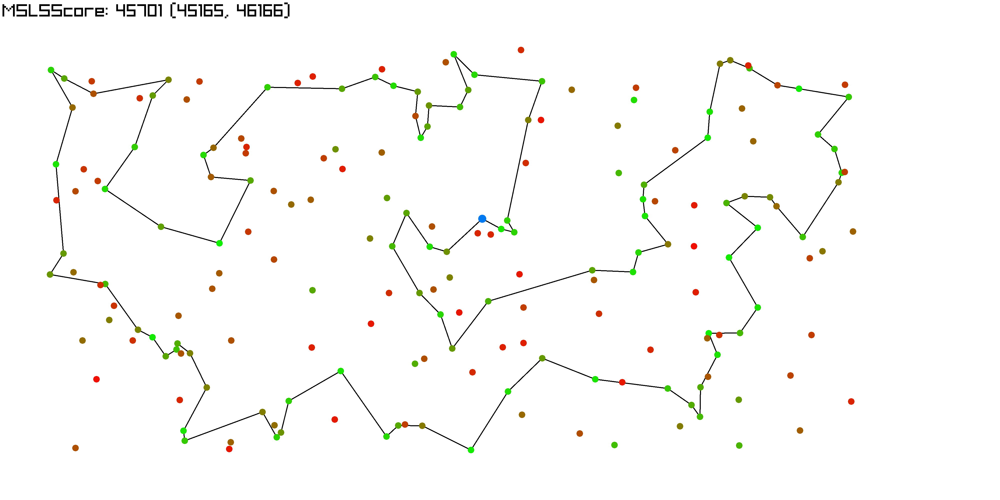
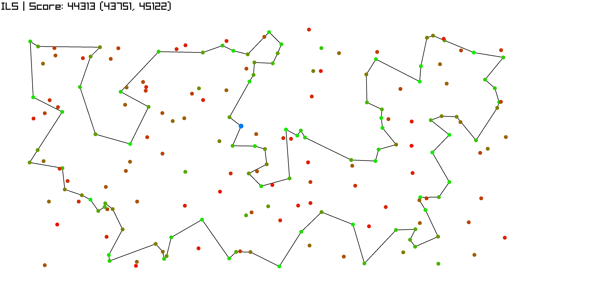

---
geometry: margin=10mm
fontsize: 4pt
...

# Report Laboratories 6

Maciej Janicki 156073
Jakub Kubiak 156049

[Source code](https://github.com/majanicki/ec/tree/trunk/lab06)

# Problem Description

Given a set of nodes, each having a set of coordinates ($x$, $y$) and inherent cost, pick exactly half of the nodes to form a Hamiltonian cycle.

The goal is to minimze the sum of total path length plus the total cost of the selected nodes.

Current implementation is about implementing Multiple start local search (MSLS) and iterated local search (ILS) with perturbation mechnism designed originally. 

# Pseudocode

# Result Comparison

| Algorithm                                          | TSPA Cost (Mean (Min, Max)) | TSPB Cost (Mean (Min, Max)) |
| -------------------------------------------------- | --------------------------- | --------------------------- |
| Random                                             | 265,135 (241,347, 291,966)  | 213,771 (190,834, 241,363)  |
| Nearest Neighbor #1                                | 85,108.5 (83,182, 89,433)   | 54,390.4 (52,319, 59,030)   |
| Nearest Neighbor #2                                | 73,601.7 (71,868, 75,953)   | 48,723.2 (44,609, 57,315)   |
| Greedy Cycle                                       | 72,646.4 (71,488, 74,410)   | 51,400.6 (49,001, 57,324)   |
| Nearest Neighbor Regret                            | 117,516 (107,945, 128,071)  | 73,512.7 (67,345, 78,889)   |
| Greedy Cycle Regret                                | 115,137 (106,052, 123,750)  | 73,316.1 (67,729, 77,498)   |
| Nearest Neighbor Regret Weighted (0.5, 0.5)        | 73,566.7 (70,894, 75,929)   | 49,847 (44,901, 57,036)     |
| Greedy Cycle Regret Weighted (0.5, 0.5)            | 72,137.6 (71,108, 73,395)   | 50,827.2 (47,144, 55,700)   |
| Nearest Neighbor Regret Weighted (0.3, 0.7)        | 75,562.1 (72,155, 78,661)   | 51,784.2 (47,543, 59,409)   |
| Greedy Cycle Regret Weighted (0.3, 0.7)            | 73,010.6 (70,475, 75,365)   | 52,420.1 (49,944, 56,179)   |
| Nearest Neighbor Regret Weighted (0.7, 0.3)        | 73,412.8 (71,519, 75,234)   | 48,816.6 (45,153, 53,425)   |
| Greedy Cycle Regret Weighted (0.7, 0.3)            | 72,437.2 (71,163, 73,759)   | 51,173.3 (49,326, 53,437)   |
| Local Search Greedy + Intra Nodes + Random Start   | 83,804.35 (77,418, 90,972)  | 59,076.75 (52,869, 67,067)  |
| Local Search Greedy + Intra Nodes + Greedy Start   | 72,806.49 (71,034, 74,987)  | 45,468.38 (43,989, 51,040)  |
| Local Search Greedy + Intra Edges + Random Start   | 73,387.63 (71,248, 78,480)  | 48,161.21 (45,907, 51,461)  |
| Local Search Greedy + Intra Edges + Greedy Start   | 71,067.07 (70,046, 73,486)  | 45,053.77 (43,947, 50,319)  |
| Local Search Steepest + Intra Nodes + Random Start | 87,883.71 (79,593, 98,325)  | 62,947.23 (54,122, 71,598)  |
| Local Search Steepest + Intra Nodes + Greedy Start | 72,807.32 (71,034, 74,904)  | 45,414.50 (43,826, 50,876)  |
| Local Search Steepest + Intra Edges + Random Start | 73,938.93 (71,428, 77,903)  | 48,323.99 (45,670, 51,667)  |
| Local Search Steepest + Intra Edges + Greedy Start | 70,975.96 (69,864, 73,068)  | 44,974.89 (43,921, 50,319)  |
| Candidate Local Search Steepest (k=10)             | 80,070.30 (75,097, 85,343)  | 49,548.59 (46,836, 51,921)  |
| Candidate Local Search Steepest (k=15)             | 76,673.52 (72,509, 80,911)  | 48,723.89 (45,961, 51,644)  |
| Candidate Local Search Steepest (k=20)             | 75,295.08 (72,316, 79,297)  | 48,457.54 (45,886, 51,560)  |
| Steepest with LM + Intra Nodes + Random Start      | 87,917.41 (80,030, 99,187)  | 62,530.10 (55,192, 69,603)  |
| Steepest with LM + Intra Edges + Random Start      | 73,486.72 (71,347, 76,128)  | 48,105.17 (45,528, 51,218)  |
| Multiple start local search (Steepest, Random init)| 71,330.35 (70,705, 71,787)  | 69,767.65 (69,355, 70,121)  |
| Iterated local search                              | 69,182.00 (69,095, 69,700)  | 43,546.80 (43,446, 43,963)  |

\newpage

# Execution Time Comparison

| Algorithm                                          | TSPA Time (Mean (Min, Max)) [ms] | TSPB Time (Mean (Min, Max)) [ms] |
| -------------------------------------------------- | -------------------------------- | -------------------------------- |
| Local Search Greedy + Intra Nodes + Random Start   | 36.36 (16.00, 69.92)             | 35.84 (19.78, 59.54)             |
| Local Search Greedy + Intra Nodes + Greedy Start   | 2.49 (1.80, 5.13)                | 2.67 (1.85, 7.62)                |
| Local Search Greedy + Intra Edges + Random Start   | 48.81 (23.56, 70.97)             | 42.71 (22.79, 62.96)             |
| Local Search Greedy + Intra Edges + Greedy Start   | 3.28 (1.95, 5.24)                | 2.92 (1.77, 7.81)                |
| Local Search Steepest + Intra Nodes + Random Start | 21.89 (16.96, 31.65)             | 22.20 (17.60, 29.57)             |
| Local Search Steepest + Intra Nodes + Greedy Start | 2.10 (1.55, 3.00)                | 2.31 (1.81, 4.95)                |
| Local Search Steepest + Intra Edges + Random Start | 15.45 (13.59, 19.09)             | 15.45 (13.17, 17.90)             |
| Local Search Steepest + Intra Edges + Greedy Start | 2.78 (1.83, 3.85)                | 2.36 (1.86, 4.88)                |
| Candidate Local Search Steepest (k=10)             | 4.31 (3.09, 7.61)                | 3.97 (3.26, 9.21)                |
| Candidate Local Search Steepest (k=15)             | 4.21 (3.74, 4.73)                | 4.17 (3.68, 4.62)                |
| Candidate Local Search Steepest (k=20)             | 4.92 (4.20, 8.74)                | 4.47 (3.86, 5.23)                |
| Steepest with LM + Intra Nodes + Random Start      | 6.11 (4.44, 8.02)                | 6.43 (4.92, 12.67)               |
| Steepest with LM + Intra Edges + Random Start      | 4.87 (3.97, 6.03)                | 4.63 (3.58, 6.56)                |
| Multiple start local search (Steepest, Random init)| 2943.55 (2702.39, 3088.22)       | 2901.23 (2733.71, 2989.75)       |
| Iterated local search                              | 2943.58 (2943.04, 2944.73)       | 2943.51 (2943.11, 2944.22)       |

\newpage

# Visualizations

## TSPA

### Multiple start local search

113, 31, 78, 145, 92, 57, 179, 196, 81, 90, 27, 165, 119, 40, 185, 55, 52, 106, 178, 14, 144, 49, 102, 62, 9, 148, 15, 114, 186, 137, 23, 89, 183, 143, 0, 117, 68, 46, 115, 139, 41, 193, 159, 69, 108, 18, 22, 146, 34, 160, 48, 54, 177, 10, 4, 112, 84, 184, 35, 131, 149, 47, 43, 42, 116, 65, 59, 118, 51, 176, 80, 124, 94, 63, 79, 133, 151, 162, 123, 127, 70, 135, 154, 180, 158, 53, 86, 75, 101, 1, 97, 152, 2, 129, 120, 44, 25, 16, 171, 175, 113

### Iterated local search

55, 52, 106, 178, 49, 14, 144, 102, 62, 9, 148, 124, 94, 63, 79, 80, 176, 137, 23, 186, 89, 183, 143, 0, 117, 93, 140, 108, 18, 22, 146, 34, 160, 48, 54, 177, 10, 190, 4, 112, 84, 184, 131, 149, 65, 116, 43, 42, 181, 159, 193, 41, 139, 68, 46, 115, 59, 118, 51, 151, 133, 162, 123, 127, 70, 135, 154, 180, 53, 100, 26, 86, 75, 101, 1, 97, 152, 2, 120, 44, 25, 16, 171, 175, 113, 56, 31, 78, 145, 196, 81, 90, 165, 119, 40, 185, 179, 92, 129, 57, 55

## TSPB

### Multiple start local search

80, 45, 175, 78, 5, 177, 36, 61, 91, 141, 21, 82, 77, 81, 153, 187, 163, 89, 127, 103, 113, 176, 194, 166, 86, 95, 130, 185, 94, 47, 148, 60, 20, 59, 28, 149, 4, 140, 183, 152, 170, 34, 55, 18, 62, 128, 124, 106, 143, 35, 109, 0, 29, 111, 8, 104, 144, 160, 33, 138, 182, 11, 139, 168, 195, 145, 15, 3, 70, 13, 132, 169, 188, 6, 147, 51, 121, 90, 10, 133, 72, 107, 40, 100, 122, 135, 63, 38, 27, 16, 1, 156, 198, 117, 193, 31, 54, 73, 136, 190, 80

### Iterated local search

140, 4, 149, 28, 20, 60, 148, 47, 94, 66, 179, 22, 99, 130, 95, 185, 86, 166, 194, 176, 113, 114, 137, 127, 89, 103, 163, 187, 153, 81, 77, 141, 91, 61, 36, 177, 5, 78, 175, 142, 45, 80, 190, 136, 73, 54, 31, 193, 117, 198, 156, 1, 131, 121, 51, 90, 122, 135, 63, 40, 107, 133, 10, 147, 6, 188, 169, 132, 70, 3, 15, 145, 13, 195, 168, 139, 11, 138, 33, 160, 144, 104, 8, 21, 82, 111, 29, 0, 109, 35, 143, 106, 124, 62, 18, 55, 34, 170, 152, 183, 140

# Conclusions

